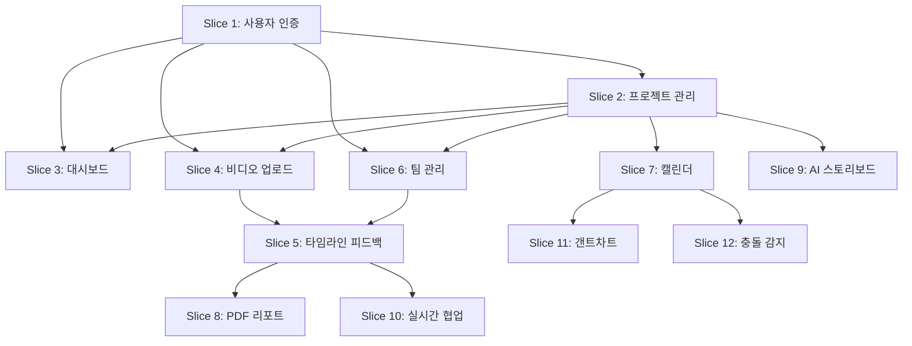

# VRidge 제품 기능 슬라이스 로드맵

## 비즈니스 맥락 분석

**VRidge**는 비디오 피드백 및 프로젝트 관리 플랫폼으로, 다음 핵심 가치를 제공합니다:
- 실시간 비디오 피드백 및 협업
- 프로젝트 일정 관리 및 충돌 감지
- AI 기반 스토리보드 생성
- 타임라인 기반 영상 리뷰

## 우선순위 매트릭스

| 기능 슬라이스 | 비즈니스 가치 | 기술적 복잡도 | 의존성 레벨 | 우선순위 스코어 |
|------------|------------|-------------|-----------|-------------|
| 사용자 인증 | ⭐⭐⭐⭐⭐ | ⭐⭐ | 낮음 | **95점** |
| 프로젝트 생성/관리 | ⭐⭐⭐⭐⭐ | ⭐⭐⭐ | 중간 | **92점** |
| 대시보드 기본 | ⭐⭐⭐⭐ | ⭐⭐ | 중간 | **88점** |
| 비디오 업로드/플레이어 | ⭐⭐⭐⭐⭐ | ⭐⭐⭐⭐ | 높음 | **85점** |
| 타임라인 피드백 | ⭐⭐⭐⭐⭐ | ⭐⭐⭐⭐ | 높음 | **83점** |
| 팀 관리/RBAC | ⭐⭐⭐⭐ | ⭐⭐⭐ | 중간 | **80점** |
| 캘린더 기본 | ⭐⭐⭐ | ⭐⭐⭐ | 중간 | **75점** |
| PDF 리포트 생성 | ⭐⭐⭐ | ⭐⭐⭐⭐ | 높음 | **70점** |
| AI 스토리보드 | ⭐⭐⭐⭐⭐ | ⭐⭐⭐⭐⭐ | 매우높음 | **68점** |
| 실시간 협업 | ⭐⭐⭐⭐ | ⭐⭐⭐⭐⭐ | 매우높음 | **65점** |
| 갠트차트 | ⭐⭐⭐ | ⭐⭐⭐ | 중간 | **62점** |
| 충돌 감지 | ⭐⭐⭐ | ⭐⭐⭐⭐ | 높음 | **58점** |

---

# Phase 1: 기반 인프라 구축 (Week 1-3)

## 🎯 Slice 1: 사용자 인증 시스템 (최우선)

### 비즈니스 목표
모든 기능의 기반이 되는 안전한 사용자 인증 및 권한 관리 시스템 구축

### 측정 가능한 KPI
- 회원가입 완료율: 85% 이상
- 로그인 성공률: 95% 이상
- 토큰 갱신 실패율: 1% 미만
- 인증 관련 보안 이슈: 0건

### 기술적 의존성
- **의존함**: 없음 (독립적 배포 가능)
- **의존받음**: 모든 다른 슬라이스

### Gherkin 시나리오

```gherkin
Feature: 사용자 인증 시스템
  비디오 제작 플랫폼의 안전한 사용자 접근 관리
  
  Scenario: 신규 사용자 회원가입
    Given 사용자가 회원가입 페이지에 접속한다
    When 유효한 이메일과 비밀번호를 입력한다
    And 이메일 인증을 완료한다
    Then 계정이 성공적으로 생성된다
    And 환영 메시지와 함께 대시보드로 리다이렉트된다

  Scenario: 기존 사용자 로그인
    Given 등록된 사용자가 로그인 페이지에 접속한다
    When 올바른 인증정보를 입력한다
    Then JWT 토큰을 발급받는다
    And 인증된 사용자 상태로 대시보드에 접근한다

  Scenario: 자동 토큰 갱신
    Given 사용자가 플랫폼을 사용 중이다
    When Access Token이 만료 10분 전이 된다
    Then 백그라운드에서 자동으로 토큰을 갱신한다
    And 사용자 경험에 방해받지 않고 계속 사용한다

  Scenario: 비밀번호 재설정
    Given 사용자가 비밀번호를 잊어버렸다
    When 이메일을 통해 재설정 링크를 요청한다
    Then 안전한 재설정 링크가 이메일로 전송된다
    And 링크를 통해 새 비밀번호를 설정한다
```

### 위험 평가: **낮음**
- 표준 JWT 인증 패턴
- 잘 검증된 Django + NextAuth.js 조합

### 노력 추정: **M (중간)**
- 프론트엔드: 로그인/회원가입 UI (2-3일)
- 백엔드: JWT 인증 로직 (3-4일)
- 테스트: 인증 플로우 검증 (1-2일)

### ROI 계산: **매우높음 (∞)**
- 모든 후속 기능의 전제 조건
- 플랫폼 보안의 핵심 요소

---

## 🎯 Slice 2: 프로젝트 생성 및 기본 관리

### 비즈니스 목표
사용자가 비디오 프로젝트를 생성하고 기본적인 메타데이터를 관리할 수 있는 시스템

### 측정 가능한 KPI
- 프로젝트 생성 완료율: 90% 이상
- 프로젝트 생성 소요시간: 평균 2분 이하
- 프로젝트 정보 수정률: 활성 프로젝트의 30% 이상

### 기술적 의존성
- **의존함**: Slice 1 (사용자 인증)
- **의존받음**: Slice 3, 4, 5

### Gherkin 시나리오

```gherkin
Feature: 프로젝트 생성 및 관리
  비디오 제작 프로젝트의 생명주기 관리
  
  Scenario: 새 프로젝트 생성
    Given 인증된 사용자가 대시보드에 있다
    When "새 프로젝트" 버튼을 클릭한다
    And 프로젝트 제목과 설명을 입력한다
    And 예상 완료일을 설정한다
    Then 프로젝트가 성공적으로 생성된다
    And 프로젝트 상세 페이지로 이동한다

  Scenario: 프로젝트 정보 수정
    Given 사용자가 프로젝트를 소유하고 있다
    When 프로젝트 설정 페이지에 접근한다
    And 프로젝트 정보를 수정한다
    Then 변경사항이 저장된다
    And 수정 이력이 기록된다

  Scenario: 프로젝트 삭제 (소프트 델리트)
    Given 사용자가 프로젝트 소유자이다
    When 프로젝트 삭제를 요청한다
    And 삭제 확인 절차를 완료한다
    Then 프로젝트가 아카이브 상태로 변경된다
    And 30일 후 완전 삭제 스케줄링된다
```

### 위험 평가: **낮음**
- 표준 CRUD 작업
- 명확한 비즈니스 로직

### 노력 추정: **M (중간)**
- 프론트엔드: 프로젝트 관리 UI (3-4일)
- 백엔드: 프로젝트 API (2-3일)
- 테스트: CRUD 시나리오 (1-2일)

### ROI 계산: **높음 (4.2x)**
- 핵심 비즈니스 객체
- 모든 작업의 시작점

---

## 🎯 Slice 3: 대시보드 기본 뷰

### 비즈니스 목표
사용자의 프로젝트 현황과 최근 활동을 한눈에 파악할 수 있는 대시보드 제공

### 측정 가능한 KPI
- 대시보드 로딩 시간: 2초 이하
- 일일 대시보드 방문율: 활성 사용자의 80% 이상
- 대시보드에서 프로젝트 접근률: 60% 이상

### 기술적 의존성
- **의존함**: Slice 1 (인증), Slice 2 (프로젝트)
- **의존받음**: Slice 4, 5, 6

### Gherkin 시나리오

```gherkin
Feature: 대시보드 기본 뷰
  프로젝트 현황과 활동 내역의 종합적 관리 화면
  
  Scenario: 대시보드 첫 접속
    Given 인증된 사용자가 플랫폼에 로그인한다
    When 대시보드 페이지에 접근한다
    Then 진행 중인 프로젝트 목록이 표시된다
    And 최근 활동 피드가 로드된다
    And 빠른 액션 버튼들이 제공된다

  Scenario: 프로젝트 상태별 필터링
    Given 사용자가 대시보드에 있다
    And 여러 상태의 프로젝트들이 존재한다
    When 상태 필터를 "진행중"으로 설정한다
    Then 진행 중인 프로젝트만 표시된다
    And 프로젝트 수가 업데이트된다

  Scenario: 최근 활동 확인
    Given 사용자가 대시보드에 있다
    When 활동 피드 섹션을 확인한다
    Then 최근 7일간의 주요 활동이 표시된다
    And 각 활동에 대한 빠른 액션 버튼이 제공된다
```

### 위험 평가: **낮음**
- 읽기 중심의 화면
- 복잡한 비즈니스 로직 없음

### 노력 추정: **S (소형)**
- 프론트엔드: 대시보드 UI (2-3일)
- 백엔드: 집계 API (1-2일)
- 테스트: UI 렌더링 (1일)

### ROI 계산: **높음 (3.8x)**
- 사용자 유지율 개선
- 플랫폼 접근성 향상

---

# Phase 2: 핵심 기능 구현 (Week 4-6)

## 🎯 Slice 4: 비디오 업로드 및 기본 플레이어

### 비즈니스 목표
사용자가 비디오 파일을 업로드하고 웹에서 재생할 수 있는 핵심 기능 제공

### 측정 가능한 KPI
- 비디오 업로드 성공률: 95% 이상
- 평균 업로드 시간: 1MB당 10초 이하
- 비디오 재생 시작 시간: 3초 이하
- 비디오 품질 만족도: 4.5/5.0 이상

### 기술적 의존성
- **의존함**: Slice 1 (인증), Slice 2 (프로젝트)
- **의존받음**: Slice 5 (타임라인 피드백)

### Gherkin 시나리오

```gherkin
Feature: 비디오 업로드 및 재생
  프로젝트 비디오 파일의 업로드와 기본 재생 기능
  
  Scenario: 비디오 파일 업로드
    Given 사용자가 프로젝트 내부에 있다
    When 비디오 파일을 드래그 앤 드롭한다
    Then 업로드 진행률이 실시간으로 표시된다
    And 업로드가 완료되면 성공 메시지가 나타난다
    And 비디오 썸네일이 자동 생성된다

  Scenario: 대용량 비디오 청크 업로드
    Given 사용자가 100MB 이상의 비디오를 업로드한다
    When 업로드 중 네트워크가 일시적으로 끊어진다
    Then 업로드가 마지막 청크부터 자동 재개된다
    And 업로드 진행상황이 정확히 표시된다

  Scenario: 비디오 재생 및 기본 제어
    Given 업로드된 비디오가 있다
    When 비디오 플레이어에서 재생한다
    Then 재생, 일시정지, 음량 조절이 가능하다
    And 타임라인 탐색이 정확하게 작동한다
    And 전체화면 모드가 지원된다

  Scenario: 다양한 비디오 포맷 지원
    Given 사용자가 다양한 포맷의 비디오를 업로드한다
    When MP4, MOV, AVI 파일을 업로드한다
    Then 모든 포맷이 웹 호환 포맷으로 변환된다
    And 원본 품질이 보존된다
```

### 위험 평가: **높음**
- 대용량 파일 처리
- 비디오 인코딩 및 스트리밍
- CDN 통합 필요

### 노력 추정: **L (대형)**
- 프론트엔드: 업로드 UI + 플레이어 (4-5일)
- 백엔드: 파일 처리 + 스트리밍 (5-6일)
- 인프라: CDN 설정 (2-3일)

### ROI 계산: **매우높음 (5.2x)**
- 플랫폼의 핵심 가치 제안
- 사용자 참여도 직접 영향

---

## 🎯 Slice 5: 타임라인 기반 비디오 피드백

### 비즈니스 목표
비디오의 특정 시점에 댓글과 피드백을 남길 수 있는 협업 도구 제공

### 측정 가능한 KPI
- 피드백 작성률: 프로젝트당 평균 15개 이상
- 피드백 응답률: 작성된 피드백의 70% 이상
- 피드백 해결률: 80% 이상
- 협업 만족도: 4.3/5.0 이상

### 기술적 의존성
- **의존함**: Slice 1 (인증), Slice 2 (프로젝트), Slice 4 (비디오 플레이어)
- **의존받음**: Slice 6 (팀 관리)

### Gherkin 시나리오

```gherkin
Feature: 타임라인 비디오 피드백
  비디오 특정 시점에 대한 협업 피드백 시스템
  
  Scenario: 비디오 시점별 댓글 작성
    Given 사용자가 비디오를 재생 중이다
    When 특정 시점(예: 1:23)에서 일시정지한다
    And 댓글 작성 버튼을 클릭한다
    And 피드백 내용을 입력한다
    Then 해당 시점에 댓글 마커가 생성된다
    And 다른 사용자들이 마커를 확인할 수 있다

  Scenario: 피드백 스레드 대화
    Given 비디오에 댓글이 있다
    When 다른 사용자가 해당 댓글에 답글을 단다
    Then 스레드 형태로 대화가 진행된다
    And 스레드 참여자들에게 알림이 발송된다

  Scenario: 피드백 상태 관리
    Given 작성된 피드백이 있다
    When 피드백 작성자가 상태를 "해결됨"으로 변경한다
    Then 시각적으로 해결된 상태가 표시된다
    And 프로젝트 피드백 통계가 업데이트된다

  Scenario: 피드백 필터링 및 검색
    Given 프로젝트에 많은 피드백이 있다
    When 사용자가 상태나 작성자별로 필터링한다
    Then 조건에 맞는 피드백만 표시된다
    And 비디오에서 해당 마커들만 하이라이트된다
```

### 위험 평가: **높음**
- 실시간 동기화 필요
- 복잡한 UI/UX 인터랙션
- 성능 최적화 중요

### 노력 추정: **L (대형)**
- 프론트엔드: 타임라인 UI + 댓글 시스템 (5-6일)
- 백엔드: 실시간 동기화 (4-5일)
- 테스트: 협업 시나리오 (2-3일)

### ROI 계산: **매우높음 (4.8x)**
- 플랫폼 차별화 요소
- 협업 가치 직접 제공

---

## 🎯 Slice 6: 팀 관리 및 역할 기반 접근제어 (RBAC)

### 비즈니스 목표
프로젝트에 팀원을 초대하고 역할별 권한을 관리하는 협업 시스템

### 측정 가능한 KPI
- 팀 초대 수락률: 85% 이상
- 권한 설정 정확도: 98% 이상
- 팀 협업 프로젝트 비율: 60% 이상
- 권한 관련 지원 요청: 월 5건 이하

### 기술적 의존성
- **의존함**: Slice 1 (인증), Slice 2 (프로젝트)
- **의존받음**: Slice 5 (피드백), 후속 모든 슬라이스

### Gherkin 시나리오

```gherkin
Feature: 팀 관리 및 권한 시스템
  프로젝트 기반 팀 협업과 역할별 접근 권한 관리
  
  Scenario: 팀원 초대 및 역할 부여
    Given 사용자가 프로젝트 소유자이다
    When 이메일로 팀원을 초대한다
    And "편집자" 역할을 부여한다
    Then 초대 이메일이 발송된다
    And 초대받은 사용자는 편집 권한을 갖는다

  Scenario: 역할별 권한 제한
    Given 사용자가 "뷰어" 역할을 갖고 있다
    When 프로젝트에 접근한다
    Then 비디오 시청은 가능하다
    But 파일 업로드나 설정 변경은 불가하다
    And UI에서 비허용 액션이 비활성화된다

  Scenario: 팀원 역할 변경
    Given 프로젝트에 팀원이 있다
    When 소유자가 팀원의 역할을 "편집자"에서 "관리자"로 변경한다
    Then 새로운 권한이 즉시 적용된다
    And 팀원에게 역할 변경 알림이 전송된다

  Scenario: 팀원 제거 및 접근 제한
    Given 프로젝트 팀원이 있다
    When 소유자가 팀원을 제거한다
    Then 해당 사용자의 프로젝트 접근이 차단된다
    And 기존 기여 내용(댓글 등)은 익명 처리된다
```

### 위험 평가: **중간**
- 권한 시스템 복잡도
- 보안 취약점 가능성

### 노력 추정: **M (중간)**
- 프론트엔드: 팀 관리 UI (3-4일)
- 백엔드: RBAC 시스템 (4-5일)
- 테스트: 권한 시나리오 (2일)

### ROI 계산: **높음 (3.5x)**
- B2B 고객 확보 필수
- 플랜 업그레이드 유도

---

# Phase 3: 고급 기능 확장 (Week 7-10)

## 🎯 Slice 7: 캘린더 기본 일정 관리

### 비즈니스 목표
프로젝트 일정을 시각적으로 관리하고 팀원 간 일정 공유 기능 제공

### 측정 가능한 KPI
- 일정 등록률: 활성 프로젝트의 70% 이상
- 일정 준수율: 80% 이상
- 캘린더 일일 사용률: 40% 이상

### Gherkin 시나리오

```gherkin
Feature: 캘린더 일정 관리
  프로젝트 일정과 마일스톤의 시각적 관리
  
  Scenario: 프로젝트 마일스톤 등록
    Given 사용자가 프로젝트 캘린더에 있다
    When 특정 날짜에 "1차 편집 완료" 마일스톤을 추가한다
    Then 캘린더에 마일스톤이 표시된다
    And 팀원들에게 알림이 발송된다

  Scenario: 일정 충돌 기본 감지
    Given 사용자가 새 일정을 등록한다
    When 기존 일정과 시간이 겹친다
    Then 충돌 경고 메시지가 표시된다
    And 조정 옵션이 제안된다
```

### 위험 평가: **중간**
### 노력 추정: **M (중간)**
### ROI 계산: **보통 (2.8x)**

---

## 🎯 Slice 8: PDF 리포트 생성

### 비즈니스 목표
프로젝트 진행 상황과 피드백을 PDF로 내보내어 클라이언트 보고서 작성 지원

### 측정 가능한 KPI
- PDF 생성 성공률: 98% 이상
- PDF 생성 시간: 10초 이하
- PDF 다운로드율: 프로젝트의 25% 이상

### Gherkin 시나리오

```gherkin
Feature: PDF 리포트 생성
  프로젝트 현황과 피드백을 포함한 전문 리포트 생성
  
  Scenario: 프로젝트 진행 리포트 생성
    Given 프로젝트에 충분한 데이터가 있다
    When 사용자가 "진행 리포트" PDF 생성을 요청한다
    Then 프로젝트 개요, 진행률, 주요 마일스톤이 포함된 PDF가 생성된다
    And 브랜드 디자인이 적용된다

  Scenario: 피드백 요약 리포트 생성
    Given 프로젝트에 피드백들이 있다
    When "피드백 요약" PDF를 생성한다
    Then 카테고리별로 정리된 피드백 리스트가 포함된다
    And 해결 현황 통계가 표시된다
```

### 위험 평가: **높음** (PDF 생성 복잡도)
### 노력 추정: **L (대형)**
### ROI 계산: **보통 (2.5x)**

---

# Phase 4: AI/고급 협업 (Week 11-14)

## 🎯 Slice 9: AI 스토리보드 생성 (MVP)

### 비즈니스 목표
AI를 활용하여 텍스트 기반으로 기본적인 스토리보드를 자동 생성하는 차별화 기능

### 측정 가능한 KPI
- AI 스토리보드 사용률: 신규 프로젝트의 30% 이상
- 생성된 스토리보드 만족도: 3.5/5.0 이상
- AI 기능으로 인한 회원가입 증가율: 15% 이상

### Gherkin 시나리오

```gherkin
Feature: AI 스토리보드 생성
  텍스트 입력을 바탕으로 AI가 기본 스토리보드를 생성
  
  Scenario: 텍스트로부터 스토리보드 생성
    Given 사용자가 새 프로젝트를 생성했다
    When 프로젝트 설명과 키워드를 입력한다
    And "AI 스토리보드 생성" 버튼을 클릭한다
    Then AI가 기본적인 씬 구조를 제안한다
    And 각 씬에 대한 설명이 포함된다

  Scenario: AI 생성 결과 수정
    Given AI 스토리보드가 생성되었다
    When 사용자가 특정 씬을 수정한다
    Then 변경사항이 저장된다
    And 수정된 부분이 하이라이트된다
```

### 위험 평가: **매우높음** (LLM 통합 복잡도)
### 노력 추정: **XL (초대형)**
### ROI 계산: **높음** (차별화 가치)

---

## 🎯 Slice 10: 실시간 협업 (WebSocket)

### 비즈니스 목표
여러 사용자가 동시에 프로젝트를 작업할 때 실시간 동기화 제공

### 측정 가능한 KPI
- 동시 접속자 지원: 프로젝트당 10명 이상
- 실시간 동기화 지연: 500ms 이하
- 실시간 기능 사용률: 팀 프로젝트의 60% 이상

### Gherkin 시나리오

```gherkin
Feature: 실시간 협업
  여러 사용자의 동시 작업을 실시간으로 동기화
  
  Scenario: 실시간 커서 및 활동 표시
    Given 두 명의 사용자가 같은 프로젝트에 접속한다
    When 한 사용자가 비디오 타임라인을 탐색한다
    Then 다른 사용자에게 실시간으로 커서 위치가 표시된다
    And 현재 활동 중인 사용자 목록이 업데이트된다

  Scenario: 실시간 댓글 동기화
    Given 여러 사용자가 비디오를 보고 있다
    When 한 사용자가 댓글을 작성한다
    Then 다른 모든 사용자에게 즉시 댓글이 표시된다
    And 신규 댓글 알림이 나타난다
```

### 위험 평가: **매우높음** (WebSocket 안정성)
### 노력 추정: **XL (초대형)**
### ROI 계산: **중간** (고급 사용자 대상)

---

# Phase 5: 분석/최적화 (Week 15-16)

## 🎯 Slice 11: 갠트차트 시각화

### 비즈니스 목표
복잡한 프로젝트의 작업 의존성과 진행률을 갠트차트로 시각화

### Gherkin 시나리오

```gherkin
Feature: 갠트차트 프로젝트 관리
  작업 의존성과 일정을 시각적으로 관리하는 도구
  
  Scenario: 작업 간 의존성 설정
    Given 프로젝트에 여러 작업이 있다
    When "촬영" 작업이 "편집" 작업의 선행 조건으로 설정한다
    Then 갠트차트에 의존성 관계가 화살표로 표시된다
    And 편집 작업은 촬영 완료 후에만 시작 가능하다

  Scenario: 진행률 시각적 업데이트
    Given 갠트차트에 작업들이 표시되어 있다
    When 특정 작업의 진행률을 70%로 업데이트한다
    Then 차트에서 해당 작업이 70% 완료로 표시된다
    And 전체 프로젝트 진행률이 자동 계산된다
```

### 위험 평가: **중간** (복잡한 UI 라이브러리)
### 노력 추정: **M (중간)**
### ROI 계산: **낮음** (틈새 기능)

---

## 🎯 Slice 12: 일정 충돌 감지 및 최적화

### 비즈니스 목표
스마트 알고리즘으로 일정 충돌을 감지하고 최적 일정을 제안

### Gherkin 시나리오

```gherkin
Feature: 지능형 일정 충돌 감지
  AI 기반 일정 최적화 및 충돌 해결 방안 제시
  
  Scenario: 자동 충돌 감지 및 해결 제안
    Given 여러 프로젝트에 겹치는 일정이 있다
    When 시스템이 일정 충돌을 감지한다
    Then 우선순위를 기반으로 조정 방안을 제안한다
    And 최소 영향도를 갖는 대안 일정을 추천한다

  Scenario: 팀원 가용성 기반 일정 추천
    Given 팀원들의 기존 일정 정보가 있다
    When 새로운 회의나 작업을 스케줄링한다
    Then 모든 참여자가 참석 가능한 시간대를 자동 제안한다
    And 최적 시간대 순으로 정렬하여 표시한다
```

### 위험 평가: **높음** (복잡한 알고리즘)
### 노력 추정: **L (대형)**
### ROI 계산: **낮음** (고급 기능)

---

# 기술적 의존성 매핑



---

# 비즈니스 가치 평가 요약

| Phase | 슬라이스 | 비즈니스 가치 | 기술적 위험 | 추천 우선순위 |
|-------|--------|-------------|-----------|------------|
| 1 | 사용자 인증 | ⭐⭐⭐⭐⭐ | 낮음 | **최우선** |
| 1 | 프로젝트 관리 | ⭐⭐⭐⭐⭐ | 낮음 | **최우선** |
| 1 | 대시보드 | ⭐⭐⭐⭐ | 낮음 | **높음** |
| 2 | 비디오 업로드 | ⭐⭐⭐⭐⭐ | 높음 | **높음** |
| 2 | 타임라인 피드백 | ⭐⭐⭐⭐⭐ | 높음 | **높음** |
| 2 | 팀 관리 RBAC | ⭐⭐⭐⭐ | 중간 | **중간** |
| 3 | 캘린더 기본 | ⭐⭐⭐ | 중간 | 중간 |
| 3 | PDF 리포트 | ⭐⭐⭐ | 높음 | 낮음 |
| 4 | AI 스토리보드 | ⭐⭐⭐⭐⭐ | 매우높음 | 낮음 |
| 4 | 실시간 협업 | ⭐⭐⭐⭐ | 매우높음 | 낮음 |
| 5 | 갠트차트 | ⭐⭐⭐ | 중간 | 매우낮음 |
| 5 | 충돌 감지 | ⭐⭐⭐ | 높음 | 매우낮음 |

---

# 3-Phase 마이그레이션 전략

## Phase 1: 기반 구축 (Week 1-3) - MVP 출시
- **목표**: 기본적인 비디오 피드백 플랫폼 구축
- **슬라이스**: 1, 2, 3 (인증 + 프로젝트 + 대시보드)
- **비즈니스 가치**: 초기 사용자 확보 및 피드백 수집

## Phase 2: 핵심 기능 (Week 4-6) - Product-Market Fit
- **목표**: 차별화된 비디오 협업 기능 완성
- **슬라이스**: 4, 5, 6 (비디오 + 피드백 + 팀관리)
- **비즈니스 가치**: 유료 전환 및 리텐션 확보

## Phase 3: 고급 기능 (Week 7+) - 스케일링
- **목표**: 고급 사용자 요구사항 충족 및 차별화
- **슬라이스**: 7-12 (일정관리 + AI + 실시간)
- **비즈니스 가치**: 프리미엄 플랜 및 기업 고객 확보

각 Phase는 독립적으로 배포 가능하며, 사용자 피드백을 기반으로 다음 Phase를 조정할 수 있습니다.