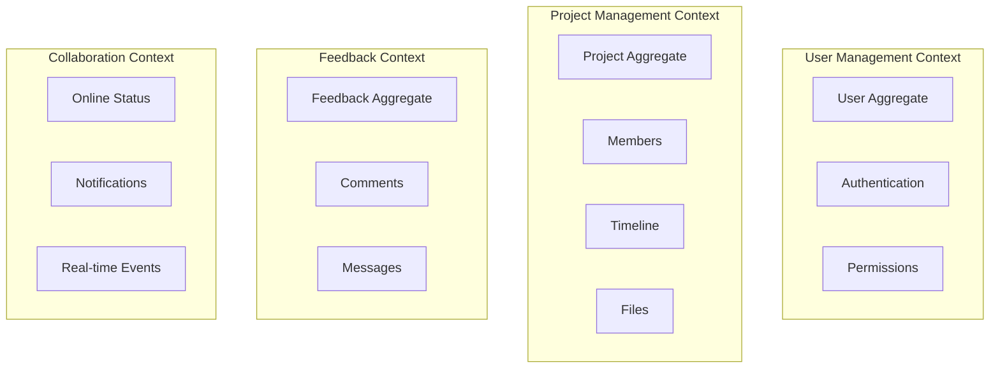

# VRidge 백엔드 아키텍처 개선 계획서

## 📋 목차
1. [현재 아키텍처 분석](#1-현재-아키텍처-분석)
2. [Domain-Driven Design 적용 방안](#2-domain-driven-design-적용-방안)
3. [API 표준화 및 버저닝 전략](#3-api-표준화-및-버저닝-전략)
4. [Railway 배포 최적화](#4-railway-배포-최적화)
5. [WebSocket 및 실시간 기능 개선](#5-websocket-및-실시간-기능-개선)
6. [구현 로드맵](#6-구현-로드맵)

---

## 1. 현재 아키텍처 분석

### 1.1 현재 구조
```
vridge_back/
├── config/          # Django 설정
├── users/           # 사용자 관리 앱
├── projects/        # 프로젝트 관리 앱
├── feedbacks/       # 피드백 관리 앱
├── onlines/         # 온라인 상태 관리 앱
└── core/            # 공통 모델/유틸리티
```

### 1.2 식별된 문제점

#### 🔴 심각한 문제점

1. **보안 취약점**
   - JWT 직접 구현 대신 커스텀 구현 사용 (보안 위험)
   - CSRF 미들웨어 비활성화
   - 비밀번호 찾기 인증번호가 평문으로 DB에 저장
   - `my_settings.py` 파일로 환경변수 관리 (보안 위험)

2. **아키텍처 문제**
   - 비즈니스 로직이 View에 집중 (Fat Views 안티패턴)
   - 도메인 모델이 빈약함 (Anemic Domain Model)
   - 서비스 레이어 부재로 복잡한 비즈니스 로직 처리 어려움
   - 트랜잭션 관리 미흡

3. **API 설계 문제**
   - RESTful 원칙 미준수 (Class-based View만 사용)
   - API 버저닝 부재
   - 일관성 없는 응답 형식
   - API 문서화 부재 (OpenAPI/Swagger 미사용)

#### 🟡 개선 필요 사항

4. **코드 품질**
   - 테스트 코드 거의 없음
   - 타입 힌팅 미사용
   - 로깅 전략 미흡
   - 에러 처리 일관성 부족

5. **성능 및 확장성**
   - N+1 쿼리 문제 다수 존재
   - 캐싱 전략 부재
   - WebSocket 연결 관리 미흡
   - 파일 업로드 크기 제한 하드코딩

6. **배포 및 운영**
   - Railway 배포 설정 파일 부재
   - 환경별 설정 분리 미흡
   - 마이그레이션 전략 부재
   - 모니터링 설정 미흡

---

## 2. Domain-Driven Design 적용 방안

### 2.1 Bounded Context 정의



### 2.2 새로운 디렉토리 구조

```
vridge_back/
├── src/
│   ├── domain/                 # 도메인 레이어
│   │   ├── users/
│   │   │   ├── entities/       # 도메인 엔티티
│   │   │   ├── value_objects/  # 값 객체
│   │   │   ├── services/       # 도메인 서비스
│   │   │   ├── repositories/   # 리포지토리 인터페이스
│   │   │   └── events/         # 도메인 이벤트
│   │   ├── projects/
│   │   └── feedbacks/
│   │
│   ├── application/            # 애플리케이션 레이어
│   │   ├── users/
│   │   │   ├── use_cases/     # 유스케이스
│   │   │   ├── dto/           # DTO
│   │   │   └── services/      # 애플리케이션 서비스
│   │   ├── projects/
│   │   └── feedbacks/
│   │
│   ├── infrastructure/        # 인프라 레이어
│   │   ├── persistence/       # DB 구현
│   │   │   ├── django_orm/
│   │   │   └── repositories/
│   │   ├── web/              # Web 레이어
│   │   │   ├── api/
│   │   │   ├── websocket/
│   │   │   └── middleware/
│   │   ├── external/         # 외부 서비스
│   │   └── messaging/        # 메시징/이벤트
│   │
│   └── shared/               # 공유 코드
│       ├── domain/
│       └── utils/
│
├── tests/                    # 테스트
│   ├── unit/
│   ├── integration/
│   └── e2e/
│
├── config/                   # 설정
│   ├── settings/
│   │   ├── base.py
│   │   ├── development.py
│   │   ├── staging.py
│   │   └── production.py
│   └── deployment/
│       ├── railway/
│       └── docker/
│
└── docs/                    # 문서
    ├── api/
    ├── architecture/
    └── deployment/
```

### 2.3 도메인 모델 예시

```python
# src/domain/projects/entities/project.py
from dataclasses import dataclass
from typing import List, Optional
from datetime import datetime
from src.domain.projects.value_objects import ProjectStatus, ProjectPhase
from src.domain.projects.events import ProjectCreated, PhaseCompleted
from src.shared.domain import AggregateRoot, DomainEvent

@dataclass
class Project(AggregateRoot):
    """프로젝트 Aggregate Root"""
    
    id: str
    name: str
    manager_id: str
    consumer: str
    description: str
    status: ProjectStatus
    phases: List[ProjectPhase]
    member_ids: List[str]
    created_at: datetime
    updated_at: datetime
    
    def __post_init__(self):
        super().__init__()
        self._validate_invariants()
    
    def _validate_invariants(self):
        """도메인 불변식 검증"""
        if not self.name:
            raise ValueError("Project name is required")
        if not self.manager_id:
            raise ValueError("Project must have a manager")
        if len(self.phases) == 0:
            raise ValueError("Project must have at least one phase")
    
    def add_member(self, user_id: str, role: str = "normal"):
        """멤버 추가"""
        if user_id in self.member_ids:
            raise ValueError(f"User {user_id} is already a member")
        
        self.member_ids.append(user_id)
        self.add_event(MemberAdded(
            project_id=self.id,
            user_id=user_id,
            role=role,
            added_at=datetime.now()
        ))
    
    def complete_phase(self, phase_name: str):
        """프로젝트 단계 완료"""
        phase = self._find_phase(phase_name)
        if not phase:
            raise ValueError(f"Phase {phase_name} not found")
        
        phase.complete()
        self.add_event(PhaseCompleted(
            project_id=self.id,
            phase_name=phase_name,
            completed_at=datetime.now()
        ))
        
        # 모든 단계가 완료되면 프로젝트도 완료
        if all(p.is_completed for p in self.phases):
            self.status = ProjectStatus.COMPLETED
    
    def _find_phase(self, phase_name: str) -> Optional[ProjectPhase]:
        return next((p for p in self.phases if p.name == phase_name), None)
```

### 2.4 유스케이스 예시

```python
# src/application/projects/use_cases/create_project.py
from dataclasses import dataclass
from typing import List
from src.domain.projects.entities import Project
from src.domain.projects.repositories import ProjectRepository
from src.domain.users.repositories import UserRepository
from src.application.projects.dto import CreateProjectDTO, ProjectDTO
from src.shared.application import UseCase, transactional

@dataclass
class CreateProjectCommand:
    name: str
    manager_email: str
    consumer: str
    description: str
    phases: List[dict]
    initial_members: List[str]

class CreateProjectUseCase(UseCase[CreateProjectCommand, ProjectDTO]):
    
    def __init__(
        self,
        project_repo: ProjectRepository,
        user_repo: UserRepository,
        event_publisher: EventPublisher
    ):
        self.project_repo = project_repo
        self.user_repo = user_repo
        self.event_publisher = event_publisher
    
    @transactional
    async def execute(self, command: CreateProjectCommand) -> ProjectDTO:
        # 1. 매니저 검증
        manager = await self.user_repo.find_by_email(command.manager_email)
        if not manager:
            raise ValueError(f"Manager {command.manager_email} not found")
        
        # 2. 프로젝트 생성
        project = Project.create(
            name=command.name,
            manager_id=manager.id,
            consumer=command.consumer,
            description=command.description,
            phases=self._build_phases(command.phases)
        )
        
        # 3. 초기 멤버 추가
        for member_email in command.initial_members:
            user = await self.user_repo.find_by_email(member_email)
            if user:
                project.add_member(user.id)
        
        # 4. 저장
        await self.project_repo.save(project)
        
        # 5. 도메인 이벤트 발행
        for event in project.collect_events():
            await self.event_publisher.publish(event)
        
        return ProjectDTO.from_entity(project)
```

---

## 3. API 표준화 및 버저닝 전략

### 3.1 RESTful API 설계 원칙

```python
# src/infrastructure/web/api/v1/projects/views.py
from rest_framework import viewsets, status
from rest_framework.decorators import action
from rest_framework.response import Response
from drf_spectacular.utils import extend_schema, OpenApiParameter
from src.application.projects.use_cases import (
    CreateProjectUseCase,
    UpdateProjectUseCase,
    AddMemberUseCase
)

@extend_schema(tags=['Projects'])
class ProjectViewSet(viewsets.ModelViewSet):
    """
    프로젝트 관리 API
    
    프로젝트 생성, 조회, 수정, 삭제 및 멤버 관리 기능을 제공합니다.
    """
    
    serializer_class = ProjectSerializer
    permission_classes = [IsAuthenticated]
    filter_backends = [DjangoFilterBackend, SearchFilter, OrderingFilter]
    filterset_fields = ['status', 'manager', 'created_at']
    search_fields = ['name', 'consumer', 'description']
    ordering_fields = ['created_at', 'updated_at', 'name']
    
    def get_queryset(self):
        return self.request.user.accessible_projects()
    
    @extend_schema(
        summary="프로젝트 생성",
        request=CreateProjectSerializer,
        responses={
            201: ProjectSerializer,
            400: ErrorSerializer
        }
    )
    def create(self, request):
        serializer = CreateProjectSerializer(data=request.data)
        serializer.is_valid(raise_exception=True)
        
        use_case = CreateProjectUseCase(
            project_repo=self.get_project_repository(),
            user_repo=self.get_user_repository(),
            event_publisher=self.get_event_publisher()
        )
        
        try:
            project = use_case.execute(serializer.validated_data)
            return Response(
                ProjectSerializer(project).data,
                status=status.HTTP_201_CREATED
            )
        except DomainException as e:
            return Response(
                ErrorSerializer({'error': str(e)}).data,
                status=status.HTTP_400_BAD_REQUEST
            )
    
    @extend_schema(
        summary="프로젝트 멤버 추가",
        request=AddMemberSerializer,
        responses={
            200: ProjectSerializer,
            400: ErrorSerializer,
            404: ErrorSerializer
        }
    )
    @action(detail=True, methods=['post'])
    def add_member(self, request, pk=None):
        project = self.get_object()
        serializer = AddMemberSerializer(data=request.data)
        serializer.is_valid(raise_exception=True)
        
        use_case = AddMemberUseCase(
            project_repo=self.get_project_repository(),
            user_repo=self.get_user_repository()
        )
        
        try:
            updated_project = use_case.execute(
                project_id=project.id,
                **serializer.validated_data
            )
            return Response(ProjectSerializer(updated_project).data)
        except DomainException as e:
            return Response(
                ErrorSerializer({'error': str(e)}).data,
                status=status.HTTP_400_BAD_REQUEST
            )
```

### 3.2 API 버저닝 전략

```python
# src/infrastructure/web/api/urls.py
from django.urls import path, include
from rest_framework.routers import DefaultRouter
from drf_spectacular.views import (
    SpectacularAPIView,
    SpectacularSwaggerView,
    SpectacularRedocView
)

# API v1 라우터
v1_router = DefaultRouter()
v1_router.register(r'projects', ProjectViewSet, basename='project')
v1_router.register(r'users', UserViewSet, basename='user')
v1_router.register(r'feedbacks', FeedbackViewSet, basename='feedback')

# API v2 라우터 (향후 확장)
v2_router = DefaultRouter()
# v2 endpoints will be added here

urlpatterns = [
    # API 버전별 엔드포인트
    path('api/v1/', include((v1_router.urls, 'v1'))),
    # path('api/v2/', include((v2_router.urls, 'v2'))),
    
    # API 문서
    path('api/schema/', SpectacularAPIView.as_view(), name='schema'),
    path('api/docs/', SpectacularSwaggerView.as_view(url_name='schema'), name='swagger-ui'),
    path('api/redoc/', SpectacularRedocView.as_view(url_name='schema'), name='redoc'),
    
    # Health checks
    path('health/', HealthCheckView.as_view(), name='health-check'),
    path('ready/', ReadinessCheckView.as_view(), name='readiness-check'),
]
```

### 3.3 표준 응답 형식

```python
# src/infrastructure/web/api/serializers/base.py
from rest_framework import serializers
from typing import Any, Dict, List, Optional

class StandardResponseSerializer(serializers.Serializer):
    """표준 API 응답 형식"""
    
    success = serializers.BooleanField(default=True)
    data = serializers.JSONField(required=False)
    error = serializers.CharField(required=False)
    message = serializers.CharField(required=False)
    timestamp = serializers.DateTimeField(default_timezone=timezone.now)
    
    class Meta:
        examples = {
            'success': {
                'success': True,
                'data': {'id': 1, 'name': 'Project Name'},
                'message': 'Project created successfully',
                'timestamp': '2024-01-20T10:00:00Z'
            },
            'error': {
                'success': False,
                'error': 'VALIDATION_ERROR',
                'message': 'Invalid project data',
                'timestamp': '2024-01-20T10:00:00Z'
            }
        }

class PaginatedResponseSerializer(StandardResponseSerializer):
    """페이지네이션 응답 형식"""
    
    count = serializers.IntegerField()
    next = serializers.URLField(allow_null=True)
    previous = serializers.URLField(allow_null=True)
    results = serializers.ListField()
```

---

## 4. Railway 배포 최적화

### 4.1 Railway 설정 파일

```toml
# railway.toml
[build]
builder = "NIXPACKS"
buildCommand = "poetry install --no-dev && python manage.py collectstatic --noinput"

[deploy]
startCommand = "gunicorn config.wsgi:application --workers 4 --threads 2 --worker-class gthread --bind 0.0.0.0:$PORT"
healthcheckPath = "/health/"
healthcheckTimeout = 30
restartPolicyType = "ON_FAILURE"
restartPolicyMaxRetries = 3

[environments.production]
DATABASE_URL = "${{Postgres.DATABASE_URL}}"
REDIS_URL = "${{Redis.REDIS_URL}}"
SECRET_KEY = "${{SECRET_KEY}}"
DEBUG = false
ALLOWED_HOSTS = "api.vridge.kr,${{RAILWAY_STATIC_URL}}"

[environments.staging]
DEBUG = true
ALLOWED_HOSTS = "*"
```

### 4.2 Dockerfile (대안)

```dockerfile
# Dockerfile
FROM python:3.9-slim

# 시스템 의존성 설치
RUN apt-get update && apt-get install -y \
    gcc \
    postgresql-client \
    && rm -rf /var/lib/apt/lists/*

# 작업 디렉토리 설정
WORKDIR /app

# Poetry 설치
RUN pip install poetry==1.3.0

# 의존성 파일 복사
COPY pyproject.toml poetry.lock ./

# 의존성 설치
RUN poetry config virtualenvs.create false \
    && poetry install --no-dev --no-interaction --no-ansi

# 소스 코드 복사
COPY . .

# 정적 파일 수집
RUN python manage.py collectstatic --noinput

# 실행 명령
CMD ["sh", "-c", "python manage.py migrate && daphne -b 0.0.0.0 -p $PORT config.asgi:application"]
```

### 4.3 환경 변수 관리

```python
# config/settings/production.py
import os
from .base import *
import dj_database_url
import sentry_sdk
from sentry_sdk.integrations.django import DjangoIntegration

# Security
SECRET_KEY = os.environ['SECRET_KEY']
DEBUG = False
ALLOWED_HOSTS = os.environ.get('ALLOWED_HOSTS', '').split(',')

# Database (Railway PostgreSQL)
DATABASES = {
    'default': dj_database_url.parse(
        os.environ['DATABASE_URL'],
        conn_max_age=600,
        conn_health_checks=True,
    )
}

# Cache (Railway Redis)
CACHES = {
    'default': {
        'BACKEND': 'django_redis.cache.RedisCache',
        'LOCATION': os.environ['REDIS_URL'],
        'OPTIONS': {
            'CLIENT_CLASS': 'django_redis.client.DefaultClient',
            'CONNECTION_POOL_KWARGS': {
                'max_connections': 50,
                'retry_on_timeout': True,
            },
            'SOCKET_CONNECT_TIMEOUT': 5,
            'SOCKET_TIMEOUT': 5,
        }
    }
}

# Channels Layer (Redis)
CHANNEL_LAYERS = {
    'default': {
        'BACKEND': 'channels_redis.core.RedisChannelLayer',
        'CONFIG': {
            'hosts': [os.environ['REDIS_URL']],
            'capacity': 1500,
            'expiry': 10,
        },
    },
}

# Static & Media Files (S3)
AWS_ACCESS_KEY_ID = os.environ['AWS_ACCESS_KEY_ID']
AWS_SECRET_ACCESS_KEY = os.environ['AWS_SECRET_ACCESS_KEY']
AWS_STORAGE_BUCKET_NAME = os.environ['AWS_STORAGE_BUCKET_NAME']
AWS_S3_REGION_NAME = os.environ.get('AWS_S3_REGION_NAME', 'ap-northeast-2')
AWS_S3_CUSTOM_DOMAIN = f'{AWS_STORAGE_BUCKET_NAME}.s3.amazonaws.com'

DEFAULT_FILE_STORAGE = 'storages.backends.s3boto3.S3Boto3Storage'
STATICFILES_STORAGE = 'storages.backends.s3boto3.StaticS3Boto3Storage'

# Sentry
sentry_sdk.init(
    dsn=os.environ['SENTRY_DSN'],
    integrations=[
        DjangoIntegration(),
    ],
    traces_sample_rate=0.1,
    send_default_pii=False,
    environment='production',
)

# Security Headers
SECURE_SSL_REDIRECT = True
SESSION_COOKIE_SECURE = True
CSRF_COOKIE_SECURE = True
SECURE_BROWSER_XSS_FILTER = True
SECURE_CONTENT_TYPE_NOSNIFF = True
X_FRAME_OPTIONS = 'DENY'
```

### 4.4 Health Check 구현

```python
# src/infrastructure/web/api/views/health.py
from django.http import JsonResponse
from django.views import View
from django.db import connection
from django.core.cache import cache
import redis
from channels.layers import get_channel_layer

class HealthCheckView(View):
    """기본 헬스 체크"""
    
    def get(self, request):
        return JsonResponse({
            'status': 'healthy',
            'service': 'vridge-api',
            'version': '1.0.0'
        })

class ReadinessCheckView(View):
    """상세 준비 상태 체크"""
    
    def get(self, request):
        checks = {
            'database': self._check_database(),
            'redis': self._check_redis(),
            'channels': self._check_channels(),
            's3': self._check_s3(),
        }
        
        all_healthy = all(checks.values())
        status_code = 200 if all_healthy else 503
        
        return JsonResponse({
            'ready': all_healthy,
            'checks': checks
        }, status=status_code)
    
    def _check_database(self):
        try:
            with connection.cursor() as cursor:
                cursor.execute("SELECT 1")
            return True
        except Exception:
            return False
    
    def _check_redis(self):
        try:
            cache.set('health_check', 'ok', 1)
            return cache.get('health_check') == 'ok'
        except Exception:
            return False
    
    def _check_channels(self):
        try:
            channel_layer = get_channel_layer()
            return channel_layer is not None
        except Exception:
            return False
    
    def _check_s3(self):
        # S3 연결 체크 로직
        return True
```

---

## 5. WebSocket 및 실시간 기능 개선

### 5.1 개선된 WebSocket Consumer

```python
# src/infrastructure/web/websocket/consumers.py
from channels.generic.websocket import AsyncJsonWebsocketConsumer
from channels.db import database_sync_to_async
from typing import Dict, Any
import json
import logging
from src.application.feedbacks.use_cases import SendFeedbackMessageUseCase
from src.infrastructure.web.websocket.authentication import WebSocketAuthMiddleware

logger = logging.getLogger(__name__)

class FeedbackConsumer(AsyncJsonWebsocketConsumer):
    """피드백 실시간 통신 Consumer"""
    
    def __init__(self, *args, **kwargs):
        super().__init__(*args, **kwargs)
        self.feedback_id = None
        self.room_group_name = None
        self.user = None
    
    async def connect(self):
        """WebSocket 연결 처리"""
        # 인증 확인
        self.user = self.scope.get('user')
        if not self.user or not self.user.is_authenticated:
            await self.close(code=4001)  # Unauthorized
            return
        
        # 피드백 ID 추출 및 권한 확인
        self.feedback_id = self.scope['url_route']['kwargs']['feedback_id']
        
        if not await self._has_access_to_feedback():
            await self.close(code=4003)  # Forbidden
            return
        
        # 룸 그룹 설정
        self.room_group_name = f'feedback_{self.feedback_id}'
        
        # 그룹에 추가
        await self.channel_layer.group_add(
            self.room_group_name,
            self.channel_name
        )
        
        await self.accept()
        
        # 연결 알림
        await self.channel_layer.group_send(
            self.room_group_name,
            {
                'type': 'user_joined',
                'user_id': self.user.id,
                'username': self.user.nickname or self.user.username
            }
        )
        
        logger.info(f"User {self.user.id} connected to feedback {self.feedback_id}")
    
    async def disconnect(self, close_code):
        """WebSocket 연결 해제 처리"""
        if self.room_group_name:
            # 연결 해제 알림
            await self.channel_layer.group_send(
                self.room_group_name,
                {
                    'type': 'user_left',
                    'user_id': self.user.id if self.user else None
                }
            )
            
            # 그룹에서 제거
            await self.channel_layer.group_discard(
                self.room_group_name,
                self.channel_name
            )
        
        logger.info(f"User {self.user.id if self.user else 'unknown'} disconnected")
    
    async def receive_json(self, content: Dict[str, Any]):
        """메시지 수신 처리"""
        message_type = content.get('type')
        
        handlers = {
            'send_message': self.handle_send_message,
            'typing_start': self.handle_typing_start,
            'typing_stop': self.handle_typing_stop,
            'mark_as_read': self.handle_mark_as_read,
        }
        
        handler = handlers.get(message_type)
        if handler:
            await handler(content)
        else:
            await self.send_json({
                'type': 'error',
                'message': f'Unknown message type: {message_type}'
            })
    
    async def handle_send_message(self, content: Dict[str, Any]):
        """메시지 전송 처리"""
        try:
            # 유스케이스 실행
            use_case = SendFeedbackMessageUseCase()
            message = await database_sync_to_async(use_case.execute)(
                feedback_id=self.feedback_id,
                user_id=self.user.id,
                text=content.get('text'),
                attachments=content.get('attachments', [])
            )
            
            # 그룹에 메시지 브로드캐스트
            await self.channel_layer.group_send(
                self.room_group_name,
                {
                    'type': 'new_message',
                    'message': {
                        'id': message.id,
                        'text': message.text,
                        'user_id': message.user_id,
                        'username': message.user.nickname or message.user.username,
                        'created_at': message.created_at.isoformat(),
                        'attachments': message.attachments
                    }
                }
            )
        except Exception as e:
            logger.error(f"Error sending message: {e}")
            await self.send_json({
                'type': 'error',
                'message': 'Failed to send message'
            })
    
    async def handle_typing_start(self, content: Dict[str, Any]):
        """타이핑 시작 알림"""
        await self.channel_layer.group_send(
            self.room_group_name,
            {
                'type': 'typing_indicator',
                'user_id': self.user.id,
                'username': self.user.nickname or self.user.username,
                'is_typing': True
            }
        )
    
    async def handle_typing_stop(self, content: Dict[str, Any]):
        """타이핑 중지 알림"""
        await self.channel_layer.group_send(
            self.room_group_name,
            {
                'type': 'typing_indicator',
                'user_id': self.user.id,
                'is_typing': False
            }
        )
    
    async def handle_mark_as_read(self, content: Dict[str, Any]):
        """읽음 처리"""
        message_ids = content.get('message_ids', [])
        # 읽음 처리 로직
        pass
    
    # 그룹 메시지 핸들러
    async def new_message(self, event):
        await self.send_json({
            'type': 'new_message',
            'message': event['message']
        })
    
    async def user_joined(self, event):
        await self.send_json({
            'type': 'user_joined',
            'user_id': event['user_id'],
            'username': event['username']
        })
    
    async def user_left(self, event):
        await self.send_json({
            'type': 'user_left',
            'user_id': event['user_id']
        })
    
    async def typing_indicator(self, event):
        await self.send_json({
            'type': 'typing_indicator',
            'user_id': event['user_id'],
            'username': event.get('username'),
            'is_typing': event['is_typing']
        })
    
    @database_sync_to_async
    def _has_access_to_feedback(self):
        """피드백 접근 권한 확인"""
        from src.domain.feedbacks.repositories import FeedbackRepository
        
        repo = FeedbackRepository()
        feedback = repo.find_by_id(self.feedback_id)
        
        if not feedback:
            return False
        
        # 프로젝트 멤버인지 확인
        return feedback.project.has_member(self.user.id)
```

### 5.2 WebSocket 라우팅

```python
# src/infrastructure/web/websocket/routing.py
from django.urls import re_path
from channels.routing import URLRouter, ProtocolTypeRouter
from channels.auth import AuthMiddlewareStack
from channels.security.websocket import AllowedHostsOriginValidator
from .consumers import FeedbackConsumer, ProjectConsumer, NotificationConsumer

websocket_urlpatterns = [
    re_path(r'ws/feedback/(?P<feedback_id>\w+)/$', FeedbackConsumer.as_asgi()),
    re_path(r'ws/project/(?P<project_id>\w+)/$', ProjectConsumer.as_asgi()),
    re_path(r'ws/notifications/$', NotificationConsumer.as_asgi()),
]

application = ProtocolTypeRouter({
    'websocket': AllowedHostsOriginValidator(
        AuthMiddlewareStack(
            URLRouter(websocket_urlpatterns)
        )
    ),
})
```

---

## 6. 구현 로드맵

### Phase 1: 기반 구축 (2주)
- [ ] 프로젝트 구조 재편성
- [ ] 환경 변수 관리 시스템 구축
- [ ] 기본 도메인 모델 구현
- [ ] 테스트 인프라 구축

### Phase 2: 도메인 모델링 (3주)
- [ ] User Management Context 구현
- [ ] Project Management Context 구현
- [ ] Feedback Context 구현
- [ ] 도메인 이벤트 시스템 구축

### Phase 3: API 개선 (2주)
- [ ] RESTful API 재설계
- [ ] API 버저닝 구현
- [ ] OpenAPI 문서화
- [ ] 인증/인가 시스템 개선

### Phase 4: 실시간 기능 개선 (2주)
- [ ] WebSocket Consumer 재구현
- [ ] 실시간 알림 시스템
- [ ] 온라인 상태 관리
- [ ] 메시지 큐 통합

### Phase 5: 배포 및 운영 (1주)
- [ ] Railway 배포 설정
- [ ] CI/CD 파이프라인
- [ ] 모니터링 및 로깅
- [ ] 성능 최적화

### Phase 6: 마이그레이션 (2주)
- [ ] 데이터 마이그레이션 계획
- [ ] 점진적 마이그레이션 실행
- [ ] 롤백 계획 수립
- [ ] 사용자 영향 최소화

---

## 성능 메트릭 목표

### API 성능
- P50 응답 시간: < 100ms
- P95 응답 시간: < 500ms
- P99 응답 시간: < 1000ms
- 처리량: > 1000 req/s

### WebSocket 성능
- 연결 수립 시간: < 500ms
- 메시지 지연: < 100ms
- 동시 연결: > 10,000

### 가용성
- 업타임: > 99.9%
- 배포 다운타임: 0 (Blue-Green 배포)
- 오류율: < 0.1%

---

## 보안 개선 사항

### 인증/인가
- JWT 토큰 갱신 메커니즘
- Refresh Token Rotation
- Rate Limiting
- IP 화이트리스팅

### 데이터 보호
- 암호화된 통신 (TLS 1.3)
- 민감 데이터 암호화
- SQL Injection 방지
- XSS/CSRF 보호

### 감사 및 모니터링
- 접근 로그
- 변경 이력 추적
- 이상 탐지
- 보안 이벤트 알림

---

## 결론

이 개선 계획을 통해 VRidge 백엔드는:
1. **유지보수성**: 명확한 책임 분리와 모듈화
2. **확장성**: 도메인 중심 설계로 비즈니스 로직 확장 용이
3. **성능**: 최적화된 쿼리와 캐싱 전략
4. **안정성**: 철저한 테스트와 에러 처리
5. **보안**: 업계 표준 보안 practices 적용

를 달성할 수 있을 것입니다.