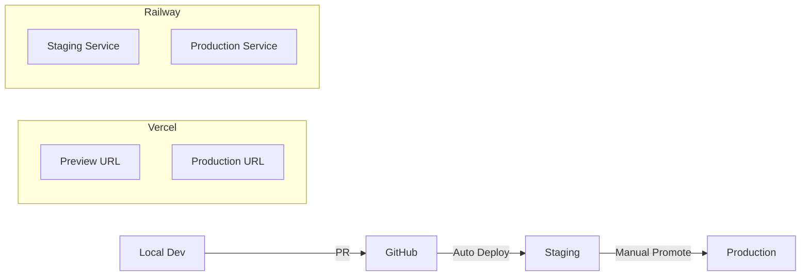

# 🚀 VRidge 배포 파이프라인 전략

## 📋 Executive Summary

### 배포 아키텍처
- **Frontend**: Vercel (Next.js App Router)
- **Backend**: Railway (Django + PostgreSQL + Redis)
- **CI/CD**: GitHub Actions
- **모니터링**: Sentry + Vercel Analytics + Railway Metrics

## 🔄 배포 워크플로우

### 1. Development → Staging → Production



## 🎯 Phase별 배포 전략

### Phase 1: 인프라 준비 (Week 1)

#### Frontend (Vercel)
```bash
# 1. Next.js 프로젝트 초기화
npx create-next-app@14 vridge-web --typescript --tailwind --app

# 2. 기존 코드 마이그레이션
cp -r vridge_front/src/* vridge-web/src/

# 3. Vercel CLI 설치 및 연결
npm i -g vercel
vercel login
vercel link

# 4. 환경변수 설정
vercel env add NEXT_PUBLIC_API_URL
vercel env add NEXT_PUBLIC_WS_URL
```

#### Backend (Railway)
```bash
# 1. Railway CLI 설치
curl -fsSL https://railway.app/install.sh | sh

# 2. 프로젝트 연결
railway login
railway link

# 3. 서비스 생성
railway service create vridge-api
railway postgres create
railway redis create

# 4. 환경변수 설정
railway variables set SECRET_KEY
railway variables set DATABASE_URL
railway variables set REDIS_URL
```

### Phase 2: CI/CD 파이프라인 구축 (Week 1-2)

#### GitHub Actions Workflow
```yaml
# .github/workflows/deploy.yml
name: Deploy Pipeline

on:
  push:
    branches: [main, staging]
  pull_request:
    branches: [main]

jobs:
  test:
    runs-on: ubuntu-latest
    steps:
      - uses: actions/checkout@v3
      
      # Frontend Tests
      - name: Frontend Tests
        run: |
          cd vridge-web
          npm ci
          npm run test
          npm run test:e2e
      
      # Backend Tests
      - name: Backend Tests
        run: |
          cd vridge_back
          poetry install
          poetry run pytest --cov
      
      # Quality Gates
      - name: Quality Check
        run: |
          npm run lint
          poetry run black --check .
          poetry run flake8

  deploy-staging:
    needs: test
    if: github.ref == 'refs/heads/staging'
    runs-on: ubuntu-latest
    steps:
      - name: Deploy to Vercel Preview
        run: vercel --token=${{ secrets.VERCEL_TOKEN }}
      
      - name: Deploy to Railway Staging
        run: |
          railway up --service vridge-api-staging

  deploy-production:
    needs: test
    if: github.ref == 'refs/heads/main'
    runs-on: ubuntu-latest
    environment: production
    steps:
      - name: Deploy to Vercel Production
        run: vercel --prod --token=${{ secrets.VERCEL_TOKEN }}
      
      - name: Deploy to Railway Production
        run: |
          railway up --service vridge-api --environment production
```

### Phase 3: 모니터링 및 알림 설정 (Week 2)

#### Sentry 통합
```typescript
// Frontend: app/layout.tsx
import * as Sentry from "@sentry/nextjs";

Sentry.init({
  dsn: process.env.NEXT_PUBLIC_SENTRY_DSN,
  environment: process.env.NODE_ENV,
  tracesSampleRate: 1.0,
});
```

```python
# Backend: settings.py
import sentry_sdk
from sentry_sdk.integrations.django import DjangoIntegration

sentry_sdk.init(
    dsn=os.environ.get('SENTRY_DSN'),
    integrations=[DjangoIntegration()],
    environment=os.environ.get('DJANGO_ENV', 'development'),
    traces_sample_rate=1.0,
)
```

#### 헬스체크 엔드포인트
```python
# vridge_back/core/views.py
from django.http import JsonResponse
from django.db import connection
import redis

def health_check(request):
    """Railway 헬스체크를 위한 엔드포인트"""
    try:
        # DB 연결 확인
        with connection.cursor() as cursor:
            cursor.execute("SELECT 1")
        
        # Redis 연결 확인
        r = redis.from_url(os.environ.get('REDIS_URL'))
        r.ping()
        
        return JsonResponse({
            'status': 'healthy',
            'timestamp': timezone.now().isoformat(),
            'version': settings.VERSION
        })
    except Exception as e:
        return JsonResponse({
            'status': 'unhealthy',
            'error': str(e)
        }, status=503)
```

## 📊 배포 메트릭

### SLO (Service Level Objectives)
| 메트릭 | 목표 | 측정 방법 |
|--------|------|----------|
| Uptime | 99.9% | Railway/Vercel Analytics |
| API Response Time | <200ms p95 | Railway Metrics |
| Build Success Rate | >95% | GitHub Actions |
| Deploy Frequency | >3/week | GitHub Insights |
| MTTR | <30min | Incident Logs |

## 🔐 보안 체크리스트

- [ ] 모든 시크릿은 환경변수로 관리
- [ ] HTTPS 강제 적용
- [ ] CORS 정책 설정
- [ ] Rate Limiting 구현
- [ ] SQL Injection 방지
- [ ] XSS 방지 헤더 설정
- [ ] 의존성 취약점 스캔

## 🚦 배포 체크리스트

### Pre-deployment
- [ ] 모든 테스트 통과
- [ ] 코드 리뷰 완료
- [ ] 데이터베이스 마이그레이션 준비
- [ ] 환경변수 확인
- [ ] 롤백 계획 수립

### Deployment
- [ ] Staging 배포 및 테스트
- [ ] Production 배포
- [ ] 헬스체크 확인
- [ ] 모니터링 대시보드 확인

### Post-deployment
- [ ] 에러율 모니터링 (30분)
- [ ] 성능 메트릭 확인
- [ ] 사용자 피드백 수집
- [ ] 배포 문서 업데이트

## 🔄 롤백 전략

### 자동 롤백 트리거
- 에러율 > 5%
- 응답시간 > 1000ms
- 헬스체크 실패

### 수동 롤백 절차
```bash
# Vercel 롤백
vercel rollback

# Railway 롤백
railway rollback --service vridge-api
```

## 📈 성능 최적화

### Frontend (Vercel)
- Edge Functions 활용
- ISR (Incremental Static Regeneration)
- 이미지 최적화 (next/image)
- 번들 크기 최적화

### Backend (Railway)
- 데이터베이스 연결 풀링
- Redis 캐싱 전략
- 비동기 작업 큐 (Celery)
- 수평 확장 준비

## 🎯 마일스톤

### Week 1-2: 기초 구축
- [x] 프로젝트 분석 완료
- [ ] Next.js 마이그레이션 시작
- [ ] Railway 서비스 생성
- [ ] CI/CD 파이프라인 구축

### Week 3-4: 핵심 기능 이전
- [ ] 인증 시스템 마이그레이션
- [ ] 프로젝트 관리 기능 이전
- [ ] WebSocket 통합
- [ ] Staging 환경 테스트

### Week 5-6: 최적화 및 안정화
- [ ] 성능 최적화
- [ ] 보안 감사
- [ ] 부하 테스트
- [ ] Production 배포

### Week 7-8: 모니터링 및 개선
- [ ] 모니터링 대시보드 구축
- [ ] 알림 시스템 구축
- [ ] 사용자 피드백 수집
- [ ] 지속적 개선

## 📚 참고 자료

- [Vercel Documentation](https://vercel.com/docs)
- [Railway Documentation](https://docs.railway.app)
- [Next.js Deployment](https://nextjs.org/docs/deployment)
- [Django Production Deployment](https://docs.djangoproject.com/en/4.2/howto/deployment/)

---

*Last Updated: 2025-08-25*
*Version: 1.0.0*