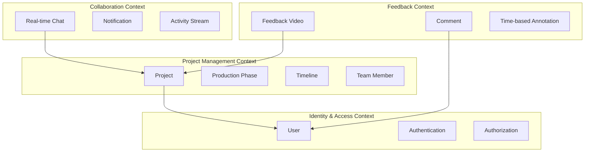

# VRidge 도메인 모델 설계서

## 📋 목차
1. [도메인 개요](#1-도메인-개요)
2. [Bounded Context 정의](#2-bounded-context-정의)
3. [핵심 도메인 모델](#3-핵심-도메인-모델)
4. [도메인 이벤트](#4-도메인-이벤트)
5. [구현 예시](#5-구현-예시)

---

## 1. 도메인 개요

VRidge는 비디오 프로덕션 프로젝트 관리 플랫폼으로, 다음과 같은 핵심 도메인을 포함합니다:

- **프로젝트 관리**: 비디오 제작 프로젝트의 생명주기 관리
- **피드백 시스템**: 실시간 피드백 및 코멘트 관리
- **협업**: 팀 멤버 간 실시간 커뮤니케이션
- **워크플로우**: 제작 단계별 진행 상황 추적

---

## 2. Bounded Context 정의



---

## 3. 핵심 도메인 모델

### 3.1 Project Aggregate

```python
# src/domain/projects/entities/project.py
from __future__ import annotations
from dataclasses import dataclass, field
from typing import List, Optional, Set
from datetime import datetime
from enum import Enum
from src.shared.domain import (
    AggregateRoot, 
    Entity, 
    ValueObject,
    DomainEvent,
    DomainException
)

class ProjectStatus(Enum):
    DRAFT = "draft"
    PLANNING = "planning"
    IN_PRODUCTION = "in_production"
    POST_PRODUCTION = "post_production"
    COMPLETED = "completed"
    ARCHIVED = "archived"

class MemberRole(Enum):
    OWNER = "owner"
    MANAGER = "manager"
    EDITOR = "editor"
    VIEWER = "viewer"

@dataclass(frozen=True)
class ProjectId(ValueObject):
    """프로젝트 ID 값 객체"""
    value: str
    
    def __post_init__(self):
        if not self.value or len(self.value) < 10:
            raise ValueError("Invalid project ID")

@dataclass(frozen=True)
class ProjectPhase(ValueObject):
    """프로젝트 단계 값 객체"""
    name: str
    start_date: Optional[datetime]
    end_date: Optional[datetime]
    is_completed: bool = False
    
    def complete(self) -> ProjectPhase:
        """단계 완료"""
        if self.is_completed:
            raise DomainException("Phase already completed")
        return ProjectPhase(
            name=self.name,
            start_date=self.start_date,
            end_date=self.end_date or datetime.now(),
            is_completed=True
        )
    
    def is_overdue(self) -> bool:
        """마감일 초과 여부"""
        if self.is_completed or not self.end_date:
            return False
        return datetime.now() > self.end_date

@dataclass
class ProjectMember(Entity):
    """프로젝트 멤버 엔티티"""
    user_id: str
    role: MemberRole
    joined_at: datetime
    permissions: Set[str] = field(default_factory=set)
    
    def change_role(self, new_role: MemberRole) -> None:
        """역할 변경"""
        if self.role == MemberRole.OWNER and new_role != MemberRole.OWNER:
            raise DomainException("Cannot change owner role")
        self.role = new_role
        self._update_permissions()
    
    def _update_permissions(self) -> None:
        """역할에 따른 권한 업데이트"""
        permission_map = {
            MemberRole.OWNER: {"create", "read", "update", "delete", "manage_members"},
            MemberRole.MANAGER: {"create", "read", "update", "manage_members"},
            MemberRole.EDITOR: {"read", "update"},
            MemberRole.VIEWER: {"read"}
        }
        self.permissions = permission_map.get(self.role, set())

@dataclass
class Project(AggregateRoot):
    """프로젝트 Aggregate Root"""
    
    id: ProjectId
    name: str
    description: str
    client_name: str
    status: ProjectStatus
    phases: List[ProjectPhase]
    members: List[ProjectMember]
    created_at: datetime
    updated_at: datetime
    deadline: Optional[datetime] = None
    
    # Business invariants
    MAX_MEMBERS = 50
    MIN_PHASES = 1
    
    def __post_init__(self):
        super().__init__()
        self._validate_invariants()
    
    def _validate_invariants(self):
        """비즈니스 불변식 검증"""
        if not self.name or len(self.name) < 3:
            raise DomainException("Project name must be at least 3 characters")
        
        if len(self.members) > self.MAX_MEMBERS:
            raise DomainException(f"Project cannot have more than {self.MAX_MEMBERS} members")
        
        if len(self.phases) < self.MIN_PHASES:
            raise DomainException(f"Project must have at least {self.MIN_PHASES} phase")
        
        # 프로젝트는 반드시 한 명의 소유자가 있어야 함
        owners = [m for m in self.members if m.role == MemberRole.OWNER]
        if len(owners) != 1:
            raise DomainException("Project must have exactly one owner")
    
    @classmethod
    def create(
        cls,
        name: str,
        description: str,
        client_name: str,
        owner_id: str,
        phases: List[dict],
        deadline: Optional[datetime] = None
    ) -> Project:
        """프로젝트 생성 팩토리 메서드"""
        project_id = ProjectId(value=cls._generate_id())
        
        # 소유자 멤버 생성
        owner = ProjectMember(
            id=cls._generate_id(),
            user_id=owner_id,
            role=MemberRole.OWNER,
            joined_at=datetime.now()
        )
        owner._update_permissions()
        
        # 단계 생성
        project_phases = [
            ProjectPhase(
                name=phase['name'],
                start_date=phase.get('start_date'),
                end_date=phase.get('end_date'),
                is_completed=False
            )
            for phase in phases
        ]
        
        project = cls(
            id=project_id,
            name=name,
            description=description,
            client_name=client_name,
            status=ProjectStatus.DRAFT,
            phases=project_phases,
            members=[owner],
            created_at=datetime.now(),
            updated_at=datetime.now(),
            deadline=deadline
        )
        
        # 도메인 이벤트 발행
        project.add_event(ProjectCreated(
            project_id=project_id.value,
            name=name,
            owner_id=owner_id,
            created_at=datetime.now()
        ))
        
        return project
    
    def add_member(self, user_id: str, role: MemberRole = MemberRole.VIEWER) -> None:
        """멤버 추가"""
        # 중복 체크
        if any(m.user_id == user_id for m in self.members):
            raise DomainException(f"User {user_id} is already a member")
        
        # 멤버 수 제한 체크
        if len(self.members) >= self.MAX_MEMBERS:
            raise DomainException(f"Cannot add more than {self.MAX_MEMBERS} members")
        
        member = ProjectMember(
            id=self._generate_id(),
            user_id=user_id,
            role=role,
            joined_at=datetime.now()
        )
        member._update_permissions()
        
        self.members.append(member)
        self.updated_at = datetime.now()
        
        self.add_event(MemberAdded(
            project_id=self.id.value,
            user_id=user_id,
            role=role.value,
            added_at=datetime.now()
        ))
    
    def remove_member(self, user_id: str) -> None:
        """멤버 제거"""
        member = next((m for m in self.members if m.user_id == user_id), None)
        if not member:
            raise DomainException(f"User {user_id} is not a member")
        
        if member.role == MemberRole.OWNER:
            raise DomainException("Cannot remove project owner")
        
        self.members.remove(member)
        self.updated_at = datetime.now()
        
        self.add_event(MemberRemoved(
            project_id=self.id.value,
            user_id=user_id,
            removed_at=datetime.now()
        ))
    
    def start_production(self) -> None:
        """제작 시작"""
        if self.status != ProjectStatus.PLANNING:
            raise DomainException("Can only start production from planning status")
        
        self.status = ProjectStatus.IN_PRODUCTION
        self.updated_at = datetime.now()
        
        self.add_event(ProductionStarted(
            project_id=self.id.value,
            started_at=datetime.now()
        ))
    
    def complete_phase(self, phase_name: str) -> None:
        """단계 완료"""
        phase_index = next(
            (i for i, p in enumerate(self.phases) if p.name == phase_name),
            None
        )
        
        if phase_index is None:
            raise DomainException(f"Phase {phase_name} not found")
        
        self.phases[phase_index] = self.phases[phase_index].complete()
        self.updated_at = datetime.now()
        
        # 모든 단계가 완료되면 프로젝트 완료
        if all(p.is_completed for p in self.phases):
            self.complete()
        
        self.add_event(PhaseCompleted(
            project_id=self.id.value,
            phase_name=phase_name,
            completed_at=datetime.now()
        ))
    
    def complete(self) -> None:
        """프로젝트 완료"""
        if self.status == ProjectStatus.COMPLETED:
            raise DomainException("Project already completed")
        
        self.status = ProjectStatus.COMPLETED
        self.updated_at = datetime.now()
        
        self.add_event(ProjectCompleted(
            project_id=self.id.value,
            completed_at=datetime.now()
        ))
    
    def is_overdue(self) -> bool:
        """프로젝트 지연 여부"""
        if self.status == ProjectStatus.COMPLETED:
            return False
        if not self.deadline:
            return False
        return datetime.now() > self.deadline
    
    def get_completion_percentage(self) -> float:
        """완료율 계산"""
        if not self.phases:
            return 0.0
        completed = sum(1 for p in self.phases if p.is_completed)
        return (completed / len(self.phases)) * 100
```

### 3.2 Feedback Aggregate

```python
# src/domain/feedbacks/entities/feedback.py
from __future__ import annotations
from dataclasses import dataclass, field
from typing import List, Optional
from datetime import datetime, timedelta
from src.shared.domain import AggregateRoot, Entity, ValueObject, DomainException

@dataclass(frozen=True)
class TimeCode(ValueObject):
    """비디오 타임코드 값 객체"""
    seconds: float
    
    def __post_init__(self):
        if self.seconds < 0:
            raise ValueError("Timecode cannot be negative")
    
    def to_string(self) -> str:
        """HH:MM:SS.fff 형식으로 변환"""
        hours = int(self.seconds // 3600)
        minutes = int((self.seconds % 3600) // 60)
        secs = self.seconds % 60
        return f"{hours:02d}:{minutes:02d}:{secs:06.3f}"
    
    @classmethod
    def from_string(cls, timecode: str) -> TimeCode:
        """문자열에서 TimeCode 생성"""
        parts = timecode.split(':')
        if len(parts) != 3:
            raise ValueError("Invalid timecode format")
        
        hours = int(parts[0])
        minutes = int(parts[1])
        seconds = float(parts[2])
        
        total_seconds = hours * 3600 + minutes * 60 + seconds
        return cls(seconds=total_seconds)

@dataclass(frozen=True)
class TimeRange(ValueObject):
    """시간 범위 값 객체"""
    start: TimeCode
    end: TimeCode
    
    def __post_init__(self):
        if self.start.seconds > self.end.seconds:
            raise ValueError("Start time must be before end time")
    
    def duration(self) -> float:
        """구간 길이(초)"""
        return self.end.seconds - self.start.seconds
    
    def contains(self, timecode: TimeCode) -> bool:
        """특정 시점이 범위 내에 있는지 확인"""
        return self.start.seconds <= timecode.seconds <= self.end.seconds

@dataclass
class FeedbackComment(Entity):
    """피드백 코멘트 엔티티"""
    
    id: str
    user_id: str
    text: str
    time_range: Optional[TimeRange]
    is_resolved: bool = False
    created_at: datetime = field(default_factory=datetime.now)
    resolved_at: Optional[datetime] = None
    resolved_by: Optional[str] = None
    replies: List[CommentReply] = field(default_factory=list)
    
    def resolve(self, user_id: str) -> None:
        """코멘트 해결"""
        if self.is_resolved:
            raise DomainException("Comment already resolved")
        
        self.is_resolved = True
        self.resolved_at = datetime.now()
        self.resolved_by = user_id
    
    def unresolve(self) -> None:
        """코멘트 미해결로 변경"""
        if not self.is_resolved:
            raise DomainException("Comment is not resolved")
        
        self.is_resolved = False
        self.resolved_at = None
        self.resolved_by = None
    
    def add_reply(self, user_id: str, text: str) -> None:
        """답글 추가"""
        reply = CommentReply(
            id=self._generate_id(),
            user_id=user_id,
            text=text,
            created_at=datetime.now()
        )
        self.replies.append(reply)

@dataclass
class CommentReply(ValueObject):
    """코멘트 답글 값 객체"""
    id: str
    user_id: str
    text: str
    created_at: datetime

@dataclass
class FeedbackVideo(Entity):
    """피드백 비디오 엔티티"""
    
    id: str
    file_url: str
    duration: float  # 비디오 길이(초)
    format: str
    size_bytes: int
    uploaded_at: datetime
    thumbnail_url: Optional[str] = None
    
    def get_duration_timecode(self) -> TimeCode:
        """비디오 길이를 TimeCode로 반환"""
        return TimeCode(seconds=self.duration)

@dataclass
class Feedback(AggregateRoot):
    """피드백 Aggregate Root"""
    
    id: str
    project_id: str
    video: FeedbackVideo
    comments: List[FeedbackComment]
    version: int
    created_at: datetime
    updated_at: datetime
    created_by: str
    
    # Business rules
    MAX_COMMENTS_PER_FEEDBACK = 500
    MAX_COMMENT_LENGTH = 5000
    
    def __post_init__(self):
        super().__init__()
        self._validate_invariants()
    
    def _validate_invariants(self):
        """비즈니스 불변식 검증"""
        if len(self.comments) > self.MAX_COMMENTS_PER_FEEDBACK:
            raise DomainException(
                f"Cannot have more than {self.MAX_COMMENTS_PER_FEEDBACK} comments"
            )
    
    @classmethod
    def create(
        cls,
        project_id: str,
        video_url: str,
        video_duration: float,
        video_format: str,
        video_size: int,
        created_by: str
    ) -> Feedback:
        """피드백 생성 팩토리 메서드"""
        video = FeedbackVideo(
            id=cls._generate_id(),
            file_url=video_url,
            duration=video_duration,
            format=video_format,
            size_bytes=video_size,
            uploaded_at=datetime.now()
        )
        
        feedback = cls(
            id=cls._generate_id(),
            project_id=project_id,
            video=video,
            comments=[],
            version=1,
            created_at=datetime.now(),
            updated_at=datetime.now(),
            created_by=created_by
        )
        
        feedback.add_event(FeedbackCreated(
            feedback_id=feedback.id,
            project_id=project_id,
            video_url=video_url,
            created_by=created_by,
            created_at=datetime.now()
        ))
        
        return feedback
    
    def add_comment(
        self,
        user_id: str,
        text: str,
        time_range: Optional[TimeRange] = None
    ) -> FeedbackComment:
        """코멘트 추가"""
        if len(self.comments) >= self.MAX_COMMENTS_PER_FEEDBACK:
            raise DomainException(
                f"Cannot add more than {self.MAX_COMMENTS_PER_FEEDBACK} comments"
            )
        
        if len(text) > self.MAX_COMMENT_LENGTH:
            raise DomainException(
                f"Comment cannot be longer than {self.MAX_COMMENT_LENGTH} characters"
            )
        
        # 타임코드가 비디오 길이를 초과하는지 검증
        if time_range:
            video_duration = self.video.get_duration_timecode()
            if time_range.end.seconds > video_duration.seconds:
                raise DomainException("Time range exceeds video duration")
        
        comment = FeedbackComment(
            id=self._generate_id(),
            user_id=user_id,
            text=text,
            time_range=time_range,
            created_at=datetime.now()
        )
        
        self.comments.append(comment)
        self.updated_at = datetime.now()
        
        self.add_event(CommentAdded(
            feedback_id=self.id,
            comment_id=comment.id,
            user_id=user_id,
            time_range=time_range,
            created_at=datetime.now()
        ))
        
        return comment
    
    def resolve_comment(self, comment_id: str, user_id: str) -> None:
        """코멘트 해결"""
        comment = self._find_comment(comment_id)
        if not comment:
            raise DomainException(f"Comment {comment_id} not found")
        
        comment.resolve(user_id)
        self.updated_at = datetime.now()
        
        self.add_event(CommentResolved(
            feedback_id=self.id,
            comment_id=comment_id,
            resolved_by=user_id,
            resolved_at=datetime.now()
        ))
    
    def get_comments_at_time(self, timecode: TimeCode) -> List[FeedbackComment]:
        """특정 시점의 코멘트 조회"""
        return [
            c for c in self.comments
            if c.time_range and c.time_range.contains(timecode)
        ]
    
    def get_unresolved_comments(self) -> List[FeedbackComment]:
        """미해결 코멘트 조회"""
        return [c for c in self.comments if not c.is_resolved]
    
    def get_resolution_rate(self) -> float:
        """코멘트 해결률"""
        if not self.comments:
            return 100.0
        
        resolved = sum(1 for c in self.comments if c.is_resolved)
        return (resolved / len(self.comments)) * 100
    
    def _find_comment(self, comment_id: str) -> Optional[FeedbackComment]:
        """코멘트 검색"""
        return next((c for c in self.comments if c.id == comment_id), None)
```

---

## 4. 도메인 이벤트

### 4.1 이벤트 정의

```python
# src/domain/projects/events.py
from dataclasses import dataclass
from datetime import datetime
from src.shared.domain import DomainEvent

@dataclass(frozen=True)
class ProjectCreated(DomainEvent):
    """프로젝트 생성 이벤트"""
    project_id: str
    name: str
    owner_id: str
    created_at: datetime

@dataclass(frozen=True)
class MemberAdded(DomainEvent):
    """멤버 추가 이벤트"""
    project_id: str
    user_id: str
    role: str
    added_at: datetime

@dataclass(frozen=True)
class MemberRemoved(DomainEvent):
    """멤버 제거 이벤트"""
    project_id: str
    user_id: str
    removed_at: datetime

@dataclass(frozen=True)
class PhaseCompleted(DomainEvent):
    """단계 완료 이벤트"""
    project_id: str
    phase_name: str
    completed_at: datetime

@dataclass(frozen=True)
class ProjectCompleted(DomainEvent):
    """프로젝트 완료 이벤트"""
    project_id: str
    completed_at: datetime

@dataclass(frozen=True)
class ProductionStarted(DomainEvent):
    """제작 시작 이벤트"""
    project_id: str
    started_at: datetime
```

### 4.2 이벤트 핸들러

```python
# src/application/projects/event_handlers.py
from typing import List
from src.domain.projects.events import (
    ProjectCreated,
    MemberAdded,
    PhaseCompleted,
    ProjectCompleted
)
from src.application.notifications.services import NotificationService
from src.application.emails.services import EmailService
from src.shared.application import EventHandler

class ProjectEventHandler(EventHandler):
    """프로젝트 도메인 이벤트 핸들러"""
    
    def __init__(
        self,
        notification_service: NotificationService,
        email_service: EmailService
    ):
        self.notification_service = notification_service
        self.email_service = email_service
    
    async def handle_project_created(self, event: ProjectCreated) -> None:
        """프로젝트 생성 이벤트 처리"""
        # 1. 소유자에게 알림 전송
        await self.notification_service.send(
            user_id=event.owner_id,
            title="프로젝트 생성 완료",
            message=f"'{event.name}' 프로젝트가 생성되었습니다.",
            type="project_created"
        )
        
        # 2. 프로젝트 생성 이메일 발송
        await self.email_service.send_project_created_email(
            project_id=event.project_id,
            owner_id=event.owner_id
        )
    
    async def handle_member_added(self, event: MemberAdded) -> None:
        """멤버 추가 이벤트 처리"""
        # 1. 새 멤버에게 알림 전송
        await self.notification_service.send(
            user_id=event.user_id,
            title="프로젝트 초대",
            message="프로젝트에 초대되었습니다.",
            type="project_invitation"
        )
        
        # 2. 초대 이메일 발송
        await self.email_service.send_invitation_email(
            project_id=event.project_id,
            user_id=event.user_id,
            role=event.role
        )
    
    async def handle_phase_completed(self, event: PhaseCompleted) -> None:
        """단계 완료 이벤트 처리"""
        # 1. 프로젝트 멤버들에게 알림
        project = await self.project_repo.find_by_id(event.project_id)
        for member in project.members:
            await self.notification_service.send(
                user_id=member.user_id,
                title="단계 완료",
                message=f"'{event.phase_name}' 단계가 완료되었습니다.",
                type="phase_completed"
            )
    
    async def handle_project_completed(self, event: ProjectCompleted) -> None:
        """프로젝트 완료 이벤트 처리"""
        # 1. 모든 멤버에게 알림
        project = await self.project_repo.find_by_id(event.project_id)
        for member in project.members:
            await self.notification_service.send(
                user_id=member.user_id,
                title="프로젝트 완료",
                message=f"프로젝트가 성공적으로 완료되었습니다.",
                type="project_completed"
            )
        
        # 2. 완료 보고서 생성
        await self.generate_completion_report(event.project_id)
```

---

## 5. 구현 예시

### 5.1 리포지토리 인터페이스

```python
# src/domain/projects/repositories.py
from abc import ABC, abstractmethod
from typing import List, Optional
from src.domain.projects.entities import Project, ProjectId

class ProjectRepository(ABC):
    """프로젝트 리포지토리 인터페이스"""
    
    @abstractmethod
    async def find_by_id(self, project_id: ProjectId) -> Optional[Project]:
        """ID로 프로젝트 조회"""
        pass
    
    @abstractmethod
    async def find_by_user(self, user_id: str) -> List[Project]:
        """사용자의 프로젝트 목록 조회"""
        pass
    
    @abstractmethod
    async def save(self, project: Project) -> None:
        """프로젝트 저장"""
        pass
    
    @abstractmethod
    async def delete(self, project_id: ProjectId) -> None:
        """프로젝트 삭제"""
        pass
    
    @abstractmethod
    async def exists(self, project_id: ProjectId) -> bool:
        """프로젝트 존재 여부 확인"""
        pass
```

### 5.2 리포지토리 구현

```python
# src/infrastructure/persistence/django_orm/repositories/project_repository.py
from typing import List, Optional
from django.db import transaction
from src.domain.projects.entities import Project, ProjectId
from src.domain.projects.repositories import ProjectRepository
from src.infrastructure.persistence.django_orm.models import ProjectModel

class DjangoProjectRepository(ProjectRepository):
    """Django ORM을 사용한 프로젝트 리포지토리 구현"""
    
    async def find_by_id(self, project_id: ProjectId) -> Optional[Project]:
        try:
            model = await ProjectModel.objects.select_related(
                'members', 'phases'
            ).aget(id=project_id.value)
            return self._to_domain(model)
        except ProjectModel.DoesNotExist:
            return None
    
    async def find_by_user(self, user_id: str) -> List[Project]:
        models = await ProjectModel.objects.filter(
            members__user_id=user_id
        ).select_related('members', 'phases').distinct()
        
        return [self._to_domain(model) for model in models]
    
    @transaction.atomic
    async def save(self, project: Project) -> None:
        # 도메인 모델을 Django 모델로 변환
        model = self._to_model(project)
        await model.asave()
        
        # 관련 엔티티 저장
        await self._save_members(project.id, project.members)
        await self._save_phases(project.id, project.phases)
    
    async def delete(self, project_id: ProjectId) -> None:
        await ProjectModel.objects.filter(id=project_id.value).adelete()
    
    async def exists(self, project_id: ProjectId) -> bool:
        return await ProjectModel.objects.filter(
            id=project_id.value
        ).aexists()
    
    def _to_domain(self, model: ProjectModel) -> Project:
        """Django 모델을 도메인 모델로 변환"""
        # 구현 생략
        pass
    
    def _to_model(self, domain: Project) -> ProjectModel:
        """도메인 모델을 Django 모델로 변환"""
        # 구현 생략
        pass
```

### 5.3 유스케이스 구현

```python
# src/application/projects/use_cases/create_project.py
from dataclasses import dataclass
from typing import List
from src.domain.projects.entities import Project
from src.domain.projects.repositories import ProjectRepository
from src.domain.users.repositories import UserRepository
from src.shared.application import UseCase, transactional
from src.shared.events import EventPublisher

@dataclass
class CreateProjectCommand:
    """프로젝트 생성 커맨드"""
    name: str
    description: str
    client_name: str
    owner_email: str
    phases: List[dict]
    initial_member_emails: List[str]

@dataclass
class ProjectDTO:
    """프로젝트 DTO"""
    id: str
    name: str
    description: str
    client_name: str
    status: str
    owner_id: str
    member_count: int
    completion_percentage: float

class CreateProjectUseCase(UseCase[CreateProjectCommand, ProjectDTO]):
    """프로젝트 생성 유스케이스"""
    
    def __init__(
        self,
        project_repo: ProjectRepository,
        user_repo: UserRepository,
        event_publisher: EventPublisher
    ):
        self.project_repo = project_repo
        self.user_repo = user_repo
        self.event_publisher = event_publisher
    
    @transactional
    async def execute(self, command: CreateProjectCommand) -> ProjectDTO:
        # 1. 소유자 확인
        owner = await self.user_repo.find_by_email(command.owner_email)
        if not owner:
            raise ValueError(f"User {command.owner_email} not found")
        
        # 2. 프로젝트 생성
        project = Project.create(
            name=command.name,
            description=command.description,
            client_name=command.client_name,
            owner_id=owner.id,
            phases=command.phases
        )
        
        # 3. 초기 멤버 추가
        for email in command.initial_member_emails:
            user = await self.user_repo.find_by_email(email)
            if user:
                project.add_member(user.id)
        
        # 4. 저장
        await self.project_repo.save(project)
        
        # 5. 도메인 이벤트 발행
        for event in project.collect_events():
            await self.event_publisher.publish(event)
        
        # 6. DTO 반환
        return ProjectDTO(
            id=project.id.value,
            name=project.name,
            description=project.description,
            client_name=project.client_name,
            status=project.status.value,
            owner_id=owner.id,
            member_count=len(project.members),
            completion_percentage=project.get_completion_percentage()
        )
```

### 5.4 애플리케이션 서비스

```python
# src/application/projects/services/project_service.py
from typing import List, Optional
from src.application.projects.use_cases import (
    CreateProjectUseCase,
    UpdateProjectUseCase,
    AddMemberUseCase,
    CompletePhaseUseCase
)
from src.domain.projects.repositories import ProjectRepository
from src.shared.application import ApplicationService

class ProjectApplicationService(ApplicationService):
    """프로젝트 애플리케이션 서비스"""
    
    def __init__(
        self,
        project_repo: ProjectRepository,
        create_project_use_case: CreateProjectUseCase,
        update_project_use_case: UpdateProjectUseCase,
        add_member_use_case: AddMemberUseCase,
        complete_phase_use_case: CompletePhaseUseCase
    ):
        self.project_repo = project_repo
        self.create_project = create_project_use_case
        self.update_project = update_project_use_case
        self.add_member = add_member_use_case
        self.complete_phase = complete_phase_use_case
    
    async def get_project_by_id(self, project_id: str) -> Optional[ProjectDTO]:
        """프로젝트 조회"""
        project = await self.project_repo.find_by_id(ProjectId(project_id))
        if not project:
            return None
        return ProjectDTO.from_entity(project)
    
    async def get_user_projects(self, user_id: str) -> List[ProjectDTO]:
        """사용자 프로젝트 목록 조회"""
        projects = await self.project_repo.find_by_user(user_id)
        return [ProjectDTO.from_entity(p) for p in projects]
    
    async def get_project_statistics(self, project_id: str) -> ProjectStatistics:
        """프로젝트 통계 조회"""
        project = await self.project_repo.find_by_id(ProjectId(project_id))
        if not project:
            raise ValueError(f"Project {project_id} not found")
        
        return ProjectStatistics(
            total_phases=len(project.phases),
            completed_phases=sum(1 for p in project.phases if p.is_completed),
            completion_rate=project.get_completion_percentage(),
            member_count=len(project.members),
            is_overdue=project.is_overdue()
        )
```

---

## 도메인 모델 테스트

```python
# tests/unit/domain/test_project.py
import pytest
from datetime import datetime, timedelta
from src.domain.projects.entities import (
    Project, 
    ProjectStatus, 
    MemberRole,
    ProjectPhase
)
from src.shared.domain import DomainException

class TestProject:
    """프로젝트 도메인 모델 테스트"""
    
    def test_create_project(self):
        """프로젝트 생성 테스트"""
        # Given
        phases = [
            {'name': '기획', 'start_date': datetime.now()},
            {'name': '제작', 'start_date': datetime.now() + timedelta(days=7)}
        ]
        
        # When
        project = Project.create(
            name="테스트 프로젝트",
            description="설명",
            client_name="테스트 클라이언트",
            owner_id="user123",
            phases=phases
        )
        
        # Then
        assert project.name == "테스트 프로젝트"
        assert project.status == ProjectStatus.DRAFT
        assert len(project.members) == 1
        assert project.members[0].role == MemberRole.OWNER
        assert len(project.phases) == 2
    
    def test_add_member(self):
        """멤버 추가 테스트"""
        # Given
        project = self._create_test_project()
        
        # When
        project.add_member("user456", MemberRole.EDITOR)
        
        # Then
        assert len(project.members) == 2
        member = next(m for m in project.members if m.user_id == "user456")
        assert member.role == MemberRole.EDITOR
        assert "update" in member.permissions
    
    def test_cannot_add_duplicate_member(self):
        """중복 멤버 추가 불가 테스트"""
        # Given
        project = self._create_test_project()
        project.add_member("user456")
        
        # When/Then
        with pytest.raises(DomainException) as exc:
            project.add_member("user456")
        assert "already a member" in str(exc.value)
    
    def test_complete_phase(self):
        """단계 완료 테스트"""
        # Given
        project = self._create_test_project()
        
        # When
        project.complete_phase("기획")
        
        # Then
        phase = project.phases[0]
        assert phase.is_completed
        assert phase.end_date is not None
    
    def test_project_completion_percentage(self):
        """프로젝트 완료율 계산 테스트"""
        # Given
        project = self._create_test_project()
        
        # When
        project.complete_phase("기획")
        percentage = project.get_completion_percentage()
        
        # Then
        assert percentage == 50.0  # 2개 중 1개 완료
    
    def test_project_overdue_check(self):
        """프로젝트 지연 체크 테스트"""
        # Given
        project = self._create_test_project()
        project.deadline = datetime.now() - timedelta(days=1)
        
        # When/Then
        assert project.is_overdue() is True
        
        # 완료된 프로젝트는 지연되지 않음
        project.status = ProjectStatus.COMPLETED
        assert project.is_overdue() is False
    
    def _create_test_project(self):
        """테스트용 프로젝트 생성"""
        return Project.create(
            name="테스트 프로젝트",
            description="테스트 설명",
            client_name="테스트 클라이언트",
            owner_id="user123",
            phases=[
                {'name': '기획'},
                {'name': '제작'}
            ]
        )
```

---

## 마무리

이 도메인 모델 설계는 VRidge 백엔드의 핵심 비즈니스 로직을 명확하게 표현하고, 유지보수성과 확장성을 높이는 것을 목표로 합니다. 

주요 장점:
1. **명확한 책임 분리**: 각 Aggregate가 자신의 불변식을 관리
2. **풍부한 도메인 모델**: 비즈니스 로직이 도메인 객체에 캡슐화
3. **이벤트 기반 아키텍처**: 느슨한 결합과 확장성
4. **테스트 용이성**: 도메인 로직을 독립적으로 테스트 가능

이 설계를 기반으로 점진적으로 기존 코드를 리팩토링하면서 새로운 기능을 추가할 수 있습니다.