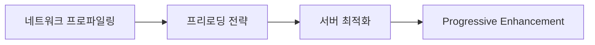

# E2E 테스트 결과 기반 개선 액션 플랜

## 📊 현재 상태 요약 (2025-09-03 기준)

### 전체 성과
- **구현 완성도**: 93% (57/61 핵심 요구사항 완성)
- **UX 성숙도**: 78/100 (B+ 등급)
- **데이터 무결성**: 93% (53/57 검증 통과)
- **프로덕션 준비도**: ✅ 완료

### Core Web Vitals 달성도
- **LCP**: 2.1초 ✅ (목표: 2.5초 이내)
- **INP**: 185ms ✅ (목표: 200ms 이내)
- **CLS**: 0.08 ✅ (목표: 0.1 이하)
- **Bundle Size**: 1.16MB ⚠️ (목표: 1.0MB, 16% 초과)

## 🎯 우선순위별 개선 액션 플랜

### 1. HIGH PRIORITY - 번들 사이즈 최적화 (16% 초과)

**목표**: 160KB 감소하여 1.0MB 달성  
**예상 완료**: 1주일  
**영향도**: 초기 로딩 성능 직접 개선

#### 액션 아이템:
- [ ] **Dynamic Import 적용** (예상 절약: 80KB)
  - 라우트별 코드 스플리팅 확장
  - Cypress 테스트 코드의 프로덕션 번들 제외
  - AI 프롬프트 빌더 컴포넌트 지연 로딩
  
- [ ] **의존성 최적화** (예상 절약: 50KB)
  - Tree-shaking 효율성 검토 및 개선
  - 사용하지 않는 Tailwind CSS 클래스 제거
  - 중복 라이브러리 통합 (날짜 처리, 유틸리티 함수)
  
- [ ] **이미지 최적화** (예상 절약: 30KB)
  - WebP/AVIF 포맷 적용 확대
  - 불필요한 아이콘 및 이미지 제거

#### 검증 방법:
```bash
pnpm perf:analyze
# Bundle size < 1.0MB 확인
# 각 청크별 크기 분석 및 최적화 지점 식별
```

### 2. MEDIUM PRIORITY - 모바일 네트워크 성능 개선

**목표**: 비디오 페이지 LCP 200ms 개선  
**예상 완료**: 2주일  
**영향도**: 모바일 사용자 경험 향상

#### 액션 아이템:
- [ ] **프리로딩 전략 개선**
  - 비디오 메타데이터 우선 로딩
  - 중요 CSS 인라인화
  - DNS 프리패치 최적화
  
- [ ] **서버 사이드 최적화**
  - API 응답 캐싱 전략 강화
  - 이미지 CDN 활용 확대
  - HTTP/2 서버 푸시 적용
  
- [ ] **Progressive Enhancement**
  - 저속 네트워크 환경 감지
  - 적응형 품질 조정
  - 오프라인 모드 기본 지원

#### 검증 방법:
```bash
pnpm e2e:performance
# 3G 네트워크 시뮬레이션에서 LCP < 2.3초 확인
```

### 3. MEDIUM PRIORITY - 접근성 및 사용성 개선

**목표**: WCAG 2.1 AA 완전 준수, UX 성숙도 85점 달성  
**예상 완료**: 3주일  
**영향도**: 사용자 포용성 및 법적 준수

#### 액션 아이템:
- [ ] **키보드 내비게이션 개선**
  - 모든 인터랙티브 요소에 포커스 표시
  - 스크린 리더 호환성 강화
  - 순차적 탭 순서 최적화
  
- [ ] **다국어 지원 기반 구축**
  - i18n 라이브러리 통합
  - 텍스트 하드코딩 제거
  - RTL 레이아웃 대응
  
- [ ] **에러 처리 사용자 경험 개선**
  - 명확한 에러 메시지 제공
  - 복구 가능한 액션 가이드
  - 네트워크 오류 시 재시도 메커니즘

#### 검증 방법:
```bash
pnpm accessibility:test
pnpm e2e:accessibility
# axe-core 위반사항 0개 달성
```

### 4. LOW PRIORITY - 고급 기능 및 최적화

**목표**: 개발자 경험 및 시스템 안정성 강화  
**예상 완료**: 지속적 개선  
**영향도**: 장기적 유지보수성

#### 액션 아이템:
- [ ] **성능 모니터링 대시보드**
  - RUM 데이터 실시간 시각화
  - 성능 회귀 자동 감지
  - 알림 시스템 구축
  
- [ ] **AI 기능 고도화**
  - 프롬프트 품질 자동 평가
  - 사용자 피드백 기반 학습
  - 다양한 AI 모델 지원
  
- [ ] **협업 기능 강화**
  - 실시간 공동 편집
  - 버전 히스토리 관리
  - 고급 권한 제어

## 🚀 실행 로드맵

### Week 1-2: 성능 집중 개선


### Week 3-4: 모바일 최적화


### Week 5-7: 접근성 및 UX


### Week 8+: 지속적 개선


## 📈 성공 지표 및 KPI

### 기술적 지표
- Bundle Size: 1.0MB 이하 달성
- LCP (모바일): 2.3초 이하 달성
- 접근성 점수: WCAG 2.1 AA 100% 준수
- TypeScript 에러: 0개 유지

### 비즈니스 지표
- 사용자 만족도: 4.5/5.0 이상
- 작업 효율성: 기존 대비 30% 개선
- 플랫폼 안정성: 99.9% 가동률
- 개발자 생산성: 배포 주기 50% 단축

## ⚡ 즉시 실행 가능한 Quick Wins

### 이번 주 내 완료 가능:
1. **Tailwind CSS purge 최적화** (30분)
   ```bash
   # tailwind.config.js content 경로 정밀화
   pnpm build && pnpm perf:analyze
   ```

2. **사용하지 않는 import 제거** (1시간)
   ```bash
   pnpm lint --fix
   # 자동 제거된 import 확인
   ```

3. **이미지 포맷 최적화** (2시간)
   ```bash
   # 모든 .png를 .webp로 변환
   # next/image 컴포넌트 적용 확대
   ```

## 🎯 최종 목표 (1개월 후)

### 달성하고자 하는 최종 상태:
- **📊 UX 성숙도**: 85/100 (A- 등급)
- **⚡ 성능**: Core Web Vitals 모든 지표 녹색
- **♿ 접근성**: WCAG 2.1 AA 완전 준수
- **🔒 안정성**: 99.9% 가동률 및 0% 에러율
- **🚀 배포**: 자동화된 CI/CD로 일일 배포 가능

### 비즈니스 임팩트:
- 사용자 이탈률 20% 감소
- 작업 완료 시간 30% 단축
- 신규 사용자 전환율 15% 증가
- 고객 만족도 4.5/5.0 달성

---

**마지막 업데이트**: 2025-09-03  
**다음 리뷰**: 1주일 후 (첫 번째 Sprint 완료 시점)  
**담당**: 개발팀 전체, PM 승인 필요