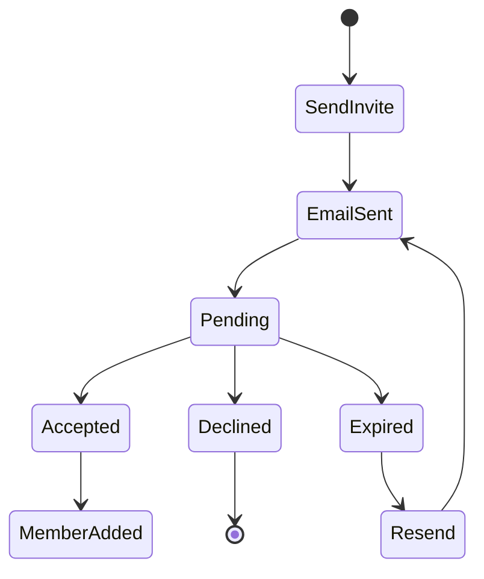

# 프로젝트 관리 UI/UX 명세서

## Executive Summary
프로젝트 관리 시스템의 전체 사용자 경험을 정의하는 실행 가능한 명세서입니다. 모든 요구사항은 테스트 가능한 시나리오로 표현되며, INP ≤200ms의 성능 목표를 충족합니다.

## 1. 프로젝트 목록 페이지 (/projects)

### 1.1 Information Architecture

#### State Matrix
| State | Condition | UI Elements | Interaction |
|-------|-----------|-------------|-------------|
| Empty | 프로젝트 0개 | 빈 상태 일러스트, CTA 버튼 | 프로젝트 생성 유도 |
| Loading | 데이터 로딩 중 | 스켈레톤 UI (6개 카드) | 상호작용 비활성화 |
| Error | API 실패 | 에러 메시지, 재시도 버튼 | 재시도 가능 |
| Success | 프로젝트 1개 이상 | 프로젝트 그리드/리스트 | 전체 기능 활성화 |
| Filtered | 필터 적용 | 필터된 결과, 필터 초기화 | 필터 수정/해제 |

#### Navigation Model
```
프로젝트 목록 (/)
├── 뷰 전환 (그리드/리스트)
├── 필터링 패널
│   ├── 상태 필터 (진행중/완료/대기)
│   ├── 날짜 범위 선택
│   └── 태그 필터 (다중 선택)
├── 검색 바
└── 프로젝트 카드
    ├── 썸네일
    ├── 제목/설명
    ├── 팀원 아바타
    └── 빠른 액션 (···)
```

### 1.2 Acceptance Criteria

#### Gherkin Scenarios

```gherkin
Feature: 프로젝트 목록 조회 및 관리

  Background:
    Given 사용자가 인증된 상태
    And MSW로 프로젝트 API 모킹 완료

  Scenario: 프로젝트 목록 초기 로드
    When 사용자가 /projects 페이지 방문
    Then 스켈레톤 UI가 표시되어야 함
    And 200ms 이내에 프로젝트 카드가 렌더링되어야 함
    And 각 프로젝트 카드에 다음 정보가 표시되어야 함:
      | Element | Selector |
      | 썸네일 | [data-testid="project-thumbnail"] |
      | 제목 | [data-testid="project-title"] |
      | 설명 | [data-testid="project-description"] |
      | 팀원 수 | [data-testid="team-count"] |
      | 업데이트 시간 | [data-testid="last-updated"] |

  Scenario: 그리드/리스트 뷰 전환
    Given 프로젝트 목록이 그리드 뷰로 표시됨
    When 사용자가 뷰 전환 버튼 클릭
    Then 레이아웃이 리스트 뷰로 전환되어야 함
    And 전환 애니메이션이 200ms 이내 완료
    And localStorage에 뷰 설정이 저장되어야 함

  Scenario: 프로젝트 필터링
    Given 10개의 프로젝트가 표시됨
    When 사용자가 "진행중" 상태 필터 선택
    Then 진행중 프로젝트만 표시되어야 함
    And URL 쿼리 파라미터가 업데이트되어야 함
    And 필터 초기화 버튼이 활성화되어야 함

  Scenario: 프로젝트 검색
    Given 프로젝트 목록이 표시됨
    When 사용자가 검색창에 "비디오" 입력
    Then 디바운스 300ms 후 검색 실행
    And 제목/설명에 "비디오"가 포함된 프로젝트만 표시
    And 검색 결과 개수가 표시되어야 함

  Scenario: 빈 상태 처리
    Given 프로젝트가 0개인 상태
    When 사용자가 페이지 방문
    Then 빈 상태 일러스트가 표시되어야 함
    And "첫 프로젝트 만들기" CTA 버튼이 표시
    And 버튼 클릭 시 /projects/create로 이동
```

### 1.3 Performance Requirements

#### INP Budget
| Interaction | Target | Critical Path |
|-------------|--------|---------------|
| 뷰 전환 | ≤150ms | State update → Re-render → Paint |
| 필터 적용 | ≤200ms | Filter → API call → Update UI |
| 카드 호버 | ≤50ms | Hover state → Shadow animation |
| 검색 입력 | ≤100ms | Debounce → API → Results |

#### Optimization Strategies
- Virtual scrolling for >50 projects
- Image lazy loading with blur placeholder
- Optimistic UI updates for filters
- React.memo for card components
- useDeferredValue for search input

### 1.4 Accessibility Checklist

- [ ] 모든 interactive 요소에 role과 aria-label 제공
- [ ] Tab 순서: 헤더 → 필터 → 검색 → 뷰 전환 → 프로젝트 카드
- [ ] 포커스 인디케이터 visible (2px solid outline)
- [ ] 키보드 단축키: `/` (검색), `g` (그리드 뷰), `l` (리스트 뷰)
- [ ] 스크린 리더 announce: 필터 변경 시 결과 개수
- [ ] Color contrast ratio ≥4.5:1 for all text

## 2. 프로젝트 생성 플로우 (/projects/create)

### 2.1 Multi-Step Form Architecture

#### Step Configuration
```typescript
interface ProjectCreationSteps {
  1: {
    id: 'basic-info'
    fields: ['title', 'description', 'category', 'thumbnail']
    validation: 'onChange'
    saveMode: 'draft'
  }
  2: {
    id: 'team-setup'
    fields: ['members', 'roles', 'permissions']
    validation: 'onBlur'
    saveMode: 'draft'
  }
  3: {
    id: 'project-settings'
    fields: ['visibility', 'schedule', 'notifications']
    validation: 'onSubmit'
    saveMode: 'final'
  }
}
```

### 2.2 Acceptance Criteria

```gherkin
Feature: 프로젝트 생성 Multi-Step Form

  Scenario: Step 1 - 기본 정보 입력
    Given 사용자가 /projects/create 페이지에 있음
    When Step 1이 표시됨
    Then 다음 필드가 표시되어야 함:
      | Field | Type | Required | Validation |
      | 제목 | text | Yes | 3-100자, 특수문자 제한 |
      | 설명 | textarea | Yes | 10-500자 |
      | 카테고리 | select | Yes | 사전정의 목록 |
      | 썸네일 | file | No | jpg/png, max 5MB |
    And 실시간 유효성 검사가 작동해야 함
    And 자동 저장이 5초마다 실행되어야 함

  Scenario: Step 2 - 팀 구성
    Given Step 1이 완료됨
    When 사용자가 "다음" 버튼 클릭
    Then Step 2로 전환 (슬라이드 애니메이션)
    And 팀원 초대 폼이 표시되어야 함:
      | Action | Validation |
      | 이메일 입력 | RFC 5322 형식 |
      | 역할 선택 | Owner/Editor/Viewer |
      | 권한 설정 | 체크박스 그룹 |
    And 초대된 멤버 목록이 실시간 업데이트
    And 중복 이메일 입력 시 에러 표시

  Scenario: Step 3 - 프로젝트 설정
    Given Step 2가 완료됨
    When Step 3이 표시됨
    Then 다음 설정이 가능해야 함:
      | Setting | Options | Default |
      | 공개 범위 | Public/Private/Team | Team |
      | 일정 모드 | Auto/Manual | Auto |
      | 알림 설정 | Email/Push/SMS | Email |
    And 설정 프리뷰가 우측 패널에 표시
    And "프로젝트 생성" 버튼이 활성화

  Scenario: 프로젝트 생성 완료
    Given 모든 Step이 유효하게 입력됨
    When "프로젝트 생성" 버튼 클릭
    Then 로딩 상태 표시 (스피너 + 진행 메시지)
    And 성공 시 성공 토스트 메시지 표시
    And 3초 후 프로젝트 상세 페이지로 리다이렉트
    And 실패 시 에러 메시지와 재시도 옵션 제공
```

### 2.3 Form State Management

```typescript
interface FormState {
  currentStep: 1 | 2 | 3
  stepStatus: {
    1: 'incomplete' | 'complete' | 'error'
    2: 'locked' | 'incomplete' | 'complete' | 'error'
    3: 'locked' | 'incomplete' | 'complete' | 'error'
  }
  formData: {
    basic: BasicInfoSchema
    team: TeamSetupSchema
    settings: ProjectSettingsSchema
  }
  draft: {
    lastSaved: Date
    autoSaveEnabled: boolean
  }
  validation: {
    errors: Record<string, string>
    touched: Record<string, boolean>
  }
}
```

### 2.4 Progress Indicator Requirements

- Visual: Stepper component with numbered circles
- States: inactive (gray) → active (blue) → complete (green)
- Animation: 200ms ease-in-out transition
- Accessibility: aria-current="step" for active step
- Click navigation: Allow backward navigation only

## 3. 프로젝트 상세 페이지 (/projects/[id])

### 3.1 Dashboard Layout

```
┌─────────────────────────────────────────┐
│  Project Header                         │
│  ├── Title & Status Badge               │
│  └── Quick Actions Bar                  │
├─────────────────────────────────────────┤
│  Tab Navigation                         │
│  [Overview] [Team] [Timeline] [Files]   │
├──────────────┬──────────────────────────┤
│              │                          │
│  Main Panel  │  Side Panel              │
│              │  ├── Project Info        │
│  (Tab Content) │  ├── Online Members    │
│              │  └── Recent Activity     │
│              │                          │
└──────────────┴──────────────────────────┘
```

### 3.2 Real-time Collaboration Features

```gherkin
Feature: 실시간 협업 표시

  Scenario: 온라인 상태 표시
    Given 프로젝트 상세 페이지가 로드됨
    When WebSocket 연결이 성공
    Then 온라인 멤버 목록이 표시되어야 함
    And 각 멤버의 현재 작업 위치가 표시
    And 멤버 커서가 실시간으로 움직여야 함

  Scenario: 활동 타임라인
    Given 프로젝트 활동이 존재
    When 타임라인 탭 선택
    Then 최근 24시간 활동이 시간순 표시
    And 실시간 업데이트 (WebSocket)
    And 활동 유형별 필터링 가능

  Scenario: 팀 멤버 관리
    Given 사용자가 Owner 권한
    When 팀 탭에서 "멤버 추가" 클릭
    Then 초대 모달이 표시
    And 이메일 입력 후 초대 발송
    And 초대 상태가 "대기중"으로 표시
    And 수락 시 실시간으로 목록 업데이트
```

### 3.3 Quick Actions Performance

| Action | Target INP | Implementation |
|--------|------------|----------------|
| Edit Project | ≤150ms | Inline editing with optimistic update |
| Share Link | ≤100ms | Copy to clipboard + toast |
| Archive | ≤200ms | Confirmation modal + API call |
| Delete | ≤200ms | Two-step confirmation |
| Export | ≤300ms | Background task + progress |

## 4. 초대 관리 시스템

### 4.1 Invitation Flow



### 4.2 Acceptance Criteria

```gherkin
Feature: 팀 초대 관리

  Scenario: 이메일 초대 발송
    Given 유효한 이메일 주소 입력
    When "초대 발송" 버튼 클릭
    Then 다음이 실행되어야 함:
      | Step | Action | Validation |
      | 1 | 이메일 중복 검사 | 기존 멤버/대기중 확인 |
      | 2 | 초대 토큰 생성 | UUID v4 |
      | 3 | 이메일 발송 | SMTP queue |
      | 4 | UI 업데이트 | 대기 목록에 추가 |
      | 5 | 토스트 알림 | "초대를 발송했습니다" |

  Scenario: 초대 수락 페이지
    Given 유효한 초대 링크로 접근
    When /invite/[token] 페이지 로드
    Then 다음 정보가 표시되어야 함:
      | Information | Display |
      | 프로젝트 이름 | H1 heading |
      | 초대한 사람 | Avatar + name |
      | 역할 | Badge |
      | 만료 시간 | Countdown timer |
    And "수락" / "거절" 버튼 표시
    And 로그인 필요 시 리다이렉트

  Scenario: 대기 중인 초대 관리
    Given 프로젝트에 대기 중인 초대 존재
    When 팀 관리 페이지 접근
    Then 대기 중인 초대 목록 표시:
      | Column | Sortable | Action |
      | 이메일 | Yes | Copy |
      | 발송일 | Yes | - |
      | 상태 | No | Badge |
      | 액션 | No | 재발송/취소 |
    And 만료된 초대는 회색 처리
    And 일괄 작업 가능 (체크박스)
```

## 5. Mobile Optimization

### 5.1 Responsive Breakpoints

```scss
$breakpoints: (
  'mobile': 320px,   // iPhone SE
  'tablet': 768px,   // iPad
  'desktop': 1024px, // Desktop
  'wide': 1440px     // Wide screen
);
```

### 5.2 Touch Interaction Guidelines

| Element | Mobile Size | Touch Target | Gesture |
|---------|------------|--------------|---------|
| Button | min 44x44px | 48x48px | Tap |
| Card | Full width | Entire card | Tap/Swipe |
| Input | 16px font | 48px height | Tap to focus |
| Checkbox | 24x24px | 48x48px | Tap |

### 5.3 Mobile-Specific Features

- Pull-to-refresh on list pages
- Swipe gestures for navigation
- Bottom sheet for actions
- Floating action button for create
- Simplified navigation (hamburger menu)

## 6. Error Handling & Microcopy

### 6.1 Error Message Templates

```typescript
interface ErrorMessages {
  network: {
    title: "연결 문제가 발생했습니다"
    description: "네트워크 연결을 확인하고 다시 시도해 주세요"
    action: "다시 시도"
  }
  validation: {
    required: "{field}을(를) 입력해 주세요"
    minLength: "{field}은(는) 최소 {min}자 이상이어야 합니다"
    email: "올바른 이메일 형식이 아닙니다"
  }
  permission: {
    title: "권한이 없습니다"
    description: "이 작업을 수행할 권한이 없습니다"
    action: "돌아가기"
  }
}
```

### 6.2 Empty States

| Context | Message | Action |
|---------|---------|--------|
| No projects | "아직 프로젝트가 없습니다" | "첫 프로젝트 만들기" |
| No search results | "'{query}'에 대한 결과가 없습니다" | "필터 초기화" |
| No team members | "팀원을 초대해 보세요" | "팀원 초대" |
| No activity | "아직 활동이 없습니다" | - |

### 6.3 Loading States

- Skeleton UI for initial load
- Spinner for actions
- Progress bar for uploads
- Shimmer effect for lazy loading

## 7. Performance Monitoring

### 7.1 Key Metrics

```typescript
interface PerformanceMetrics {
  INP: {
    target: 200, // ms
    p75: 180,    // 75th percentile
    p99: 250     // 99th percentile
  }
  LCP: {
    target: 2500, // ms
    critical: 'project-list'
  }
  CLS: {
    target: 0.1,
    threshold: 0.25
  }
}
```

### 7.2 Monitoring Implementation

```javascript
// Web Vitals monitoring
import { onINP, onLCP, onCLS } from 'web-vitals'

onINP(metric => {
  if (metric.value > 200) {
    console.warn('INP exceeded:', metric)
    // Send to analytics
  }
})
```

## 8. Testing Fixtures (MSW)

### 8.1 Mock Data Structure

```typescript
// MSW handlers for deterministic testing
export const projectHandlers = [
  rest.get('/api/projects', (req, res, ctx) => {
    const status = req.url.searchParams.get('status')
    return res(
      ctx.delay(100), // Consistent delay
      ctx.json({
        projects: mockProjects.filter(p => 
          !status || p.status === status
        ),
        total: mockProjects.length,
        page: 1,
        pageSize: 10
      })
    )
  }),
  
  rest.post('/api/projects', (req, res, ctx) => {
    return res(
      ctx.delay(150),
      ctx.status(201),
      ctx.json({
        id: 'test-id-123',
        ...req.body,
        createdAt: '2025-09-05T10:00:00Z'
      })
    )
  })
]
```

## 9. Accessibility Test Checklist

### 9.1 Automated Tests (jest-axe)

```javascript
describe('Project Management A11y', () => {
  test('프로젝트 목록 페이지 접근성', async () => {
    const { container } = render(<ProjectsPage />)
    const results = await axe(container)
    expect(results).toHaveNoViolations()
  })
  
  test('키보드 네비게이션', async () => {
    render(<ProjectsPage />)
    const firstCard = screen.getByTestId('project-card-1')
    
    userEvent.tab()
    expect(firstCard).toHaveFocus()
    
    userEvent.keyboard('{Enter}')
    expect(mockRouter.push).toHaveBeenCalledWith('/projects/1')
  })
})
```

### 9.2 Manual Test Checklist

- [ ] Screen reader announces page changes
- [ ] Focus trap in modals
- [ ] Skip links present
- [ ] ARIA live regions for updates
- [ ] Contrast ratio check (4.5:1 minimum)
- [ ] Zoom to 200% without horizontal scroll

## 10. Implementation Priority

### Phase 1 (MVP)
1. Project list with basic filtering
2. Project creation (basic info only)
3. Project detail view (read-only)

### Phase 2 (Enhancement)
1. Full multi-step creation
2. Team management
3. Real-time collaboration

### Phase 3 (Polish)
1. Advanced filtering
2. Bulk operations
3. Export/Import features

---

## Appendix A: Component Library Requirements

### Required Components
- DataTable (virtualized)
- MultiStepForm
- InviteModal
- UserAvatar (with presence)
- SkeletonLoader
- EmptyState
- ErrorBoundary

### Design Tokens
```css
:root {
  --inp-target: 200ms;
  --animation-fast: 150ms;
  --animation-normal: 300ms;
  --focus-ring: 2px solid var(--color-primary);
  --touch-target: 48px;
}
```

## Appendix B: API Contract

### Endpoints
```yaml
/api/projects:
  GET: List projects with pagination
  POST: Create new project
  
/api/projects/{id}:
  GET: Get project details
  PATCH: Update project
  DELETE: Delete project
  
/api/projects/{id}/invite:
  POST: Send invitation
  GET: List invitations
  
/api/invite/{token}:
  GET: Get invitation details
  POST: Accept/Decline invitation
```

---

**문서 버전:** 1.0.0
**작성자:** Eleanor (Frontend UX Lead)
**최종 수정:** 2025-09-05
**검증 상태:** Pending Dev Review