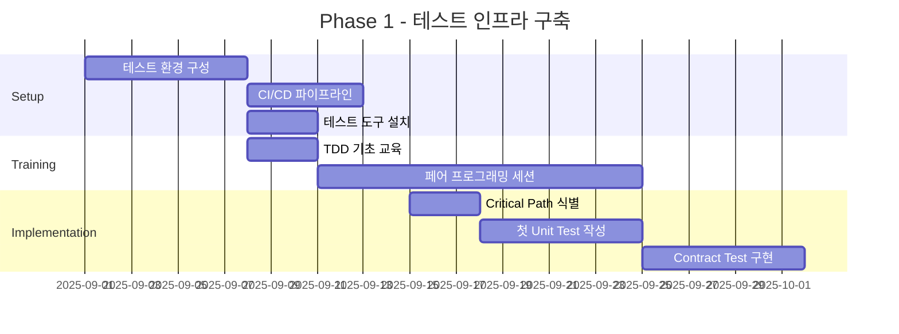

# vridge 프로젝트 TDD 전환 및 테스트 전략
## Grace (QA Lead) 수립 - 2025.08.25

---

## 📊 Executive Summary

### 현재 상황 분석
- **Frontend**: 테스트 인프라 전무 (0% 커버리지)
- **Backend**: 기본 테스트 파일만 존재, 실제 테스트 미구현
- **위험도**: 🔴 Critical - 무방비 상태의 프로덕션 코드

### 목표 설정 (6개월)
- **Phase 1 (2개월)**: Critical Path Coverage 50% 달성
- **Phase 2 (4개월)**: 전체 커버리지 70%, Critical Path 90%
- **Phase 3 (6개월)**: TDD 문화 정착, Mutation Score 75%+

---

## 🎯 Part 1: 현재 상태 진단 및 리스크 분석

### 1.1 테스트 성숙도 평가 (CMM Level)
```
현재: Level 0 - Chaotic
├─ 테스트 인프라 없음
├─ 테스트 문화 부재
└─ 품질 메트릭 미측정

목표: Level 3 - Defined
├─ 표준화된 테스트 프로세스
├─ 자동화된 테스트 실행
└─ 품질 게이트 운영
```

### 1.2 비즈니스 리스크 매트릭스
| 영역 | 리스크 레벨 | 영향도 | 현재 커버리지 | 목표 커버리지 |
|------|------------|--------|--------------|--------------|
| 인증/권한 | 🔴 Critical | 매우 높음 | 0% | 95% |
| 프로젝트 CRUD | 🟠 High | 높음 | 0% | 90% |
| 피드백 시스템 | 🟠 High | 높음 | 0% | 85% |
| 온라인 협업 | 🟡 Medium | 중간 | 0% | 75% |
| UI 컴포넌트 | 🟢 Low | 낮음 | 0% | 60% |

### 1.3 기술 부채 현황
```typescript
// 추정 기술 부채 시간
const technicalDebt = {
  missingTests: 320, // hours
  refactoringNeeded: 180, // hours
  documentationGap: 60, // hours
  total: 560 // hours (약 3.5 개발자-월)
};
```

---

## 🏗️ Part 2: FSD 레이어별 테스트 전략

### 2.1 테스트 피라미드 설계
```
         ╱╲        E2E Tests (5%)
        ╱  ╲       - Critical User Journeys
       ╱────╲      - 10-15 시나리오
      ╱      ╲     
     ╱────────╲    Integration Tests (25%)
    ╱          ╲   - API Contract Tests
   ╱            ╲  - Component Integration
  ╱──────────────╲ 
 ╱                ╲ Unit Tests (70%)
╱                  ╲- Business Logic
────────────────────- Utilities & Helpers
```

### 2.2 FSD 레이어별 테스트 매트릭스

#### App Layer
```typescript
// app/providers/test-strategy.ts
interface AppTestStrategy {
  providers: {
    coverage: "90%",
    focus: ["라우팅", "전역 상태", "에러 바운더리"],
    tools: ["React Testing Library", "MSW"],
    priority: "P0-Critical"
  }
}
```

#### Pages Layer
```typescript
interface PageTestStrategy {
  coverage: "75%",
  testTypes: {
    integration: ["페이지 라우팅", "레이아웃 렌더링"],
    snapshot: ["UI 일관성"],
    accessibility: ["WCAG 2.1 Level AA"]
  },
  priority: "P1-High"
}
```

#### Widgets Layer
```typescript
interface WidgetTestStrategy {
  coverage: "80%",
  testTypes: {
    integration: ["위젯 간 통신", "상태 동기화"],
    unit: ["개별 위젯 로직"],
    visual: ["스토리북 스냅샷"]
  },
  priority: "P1-High"
}
```

#### Features Layer
```typescript
interface FeatureTestStrategy {
  coverage: "85%",
  testTypes: {
    unit: ["비즈니스 로직", "상태 관리"],
    integration: ["API 통신", "사이드 이펙트"],
    contract: ["API 스키마 검증"]
  },
  priority: "P0-Critical"
}
```

#### Entities Layer
```typescript
interface EntityTestStrategy {
  coverage: "95%",
  testTypes: {
    unit: ["모델 검증", "타입 가드"],
    serialization: ["직렬화/역직렬화"],
    validation: ["데이터 무결성"]
  },
  priority: "P0-Critical"
}
```

#### Shared Layer
```typescript
interface SharedTestStrategy {
  coverage: "90%",
  testTypes: {
    unit: ["유틸리티 함수", "커스텀 훅"],
    performance: ["메모이제이션", "최적화"],
    edge: ["경계값, 예외 케이스"]
  },
  priority: "P2-Medium"
}
```

---

## 🛠️ Part 3: 테스트 도구 및 인프라 설정

### 3.1 Frontend 테스트 스택
```json
{
  "testing": {
    "unit": {
      "framework": "Vitest",
      "reason": "Next.js 최적화, 빠른 실행 속도"
    },
    "component": {
      "library": "@testing-library/react",
      "utilities": ["user-event", "jest-dom"]
    },
    "integration": {
      "api": "MSW (Mock Service Worker)",
      "database": "Prisma Mock Client"
    },
    "e2e": {
      "framework": "Playwright",
      "config": "cross-browser, mobile viewport"
    },
    "visual": {
      "tool": "Storybook + Chromatic",
      "coverage": "Critical UI Components"
    }
  }
}
```

### 3.2 Backend 테스트 스택
```python
# requirements-test.txt
pytest==7.4.0
pytest-django==4.5.2
pytest-cov==4.1.0
factory-boy==3.3.0
faker==19.2.0
pytest-mock==3.11.1
pytest-asyncio==0.21.1
responses==0.23.3

# 성능 테스트
locust==2.15.1
pytest-benchmark==4.0.0
```

### 3.3 테스트 환경 구성
```yaml
# docker-compose.test.yml
version: '3.8'
services:
  test-db:
    image: postgres:15-alpine
    environment:
      POSTGRES_DB: test_vridge
      POSTGRES_USER: test_user
      POSTGRES_PASSWORD: test_pass
    tmpfs:
      - /var/lib/postgresql/data
  
  test-redis:
    image: redis:7-alpine
    command: redis-server --appendonly no
    tmpfs:
      - /data
```

---

## 📈 Part 4: 품질 메트릭 및 KPI

### 4.1 핵심 품질 지표
```typescript
interface QualityMetrics {
  coverage: {
    line: { current: 0, target: 70, critical: 90 },
    branch: { current: 0, target: 65, critical: 85 },
    function: { current: 0, target: 75, critical: 95 }
  },
  
  performance: {
    unitTestTime: { max: "5s", current: null },
    integrationTestTime: { max: "30s", current: null },
    e2eTestTime: { max: "5m", current: null }
  },
  
  reliability: {
    flakyTestRate: { max: 0.01, current: null },
    mutationScore: { min: 0.75, current: null },
    escapedDefects: { max: 2, current: null } // per sprint
  }
}
```

### 4.2 품질 게이트 설정
```yaml
# .github/workflows/quality-gates.yml
quality_gates:
  pr_merge:
    - coverage_delta: ">= 0"  # 커버리지 감소 불허
    - new_code_coverage: ">= 80%"  # 신규 코드 80% 이상
    - tests_passing: "100%"
    - no_critical_issues: true
    - performance_regression: "< 5%"
  
  release:
    - overall_coverage: ">= 70%"
    - critical_path_coverage: ">= 90%"
    - e2e_tests_passing: "100%"
    - security_scan_passed: true
    - load_test_passed: true
```

---

## 🎓 Part 5: TDD 도입 로드맵

### 5.1 Phase 1: Foundation (Month 1-2)


### 5.2 Phase 2: Expansion (Month 3-4)
```typescript
const phase2Goals = {
  coverage: {
    unit: "50%+",
    integration: "30%+",
    e2e: "Critical paths only"
  },
  
  practices: [
    "모든 버그 수정 시 테스트 먼저 작성",
    "PR에 테스트 필수 포함",
    "일일 테스트 리포트 자동화"
  ],
  
  milestones: [
    "첫 번째 Mutation Testing 실행",
    "테스트 커버리지 대시보드 구축",
    "팀 전체 TDD 사이클 적용"
  ]
};
```

### 5.3 Phase 3: Maturity (Month 5-6)
```typescript
const phase3Goals = {
  culture: [
    "TDD가 기본 개발 프로세스로 정착",
    "테스트 없는 코드 = 미완성 코드 인식",
    "품질 메트릭 기반 의사결정"
  ],
  
  automation: [
    "Visual Regression Testing 자동화",
    "Performance Testing 자동화",
    "Security Testing 통합"
  ],
  
  optimization: [
    "테스트 실행 시간 50% 단축",
    "Flaky Test 제로화",
    "테스트 유지보수 비용 최소화"
  ]
};
```

---

## 🚦 Part 6: 우선순위 매트릭스

### 6.1 기능별 테스트 우선순위
```typescript
enum TestPriority {
  P0_CRITICAL = "24시간 내 구현",
  P1_HIGH = "1주일 내 구현",
  P2_MEDIUM = "2주일 내 구현",
  P3_LOW = "백로그 관리"
}

const testPriorityMatrix = {
  // P0 - Critical (비즈니스 핵심)
  P0: [
    "사용자 인증/인가",
    "결제 프로세스",
    "데이터 무결성",
    "보안 취약점"
  ],
  
  // P1 - High (주요 기능)
  P1: [
    "프로젝트 CRUD",
    "피드백 시스템",
    "실시간 협업",
    "알림 시스템"
  ],
  
  // P2 - Medium (사용자 경험)
  P2: [
    "UI 컴포넌트",
    "검색/필터",
    "캘린더 기능",
    "프로필 관리"
  ],
  
  // P3 - Low (부가 기능)
  P3: [
    "통계/분석",
    "내보내기",
    "테마 설정",
    "도움말"
  ]
};
```

### 6.2 리스크 기반 테스트 선정
```typescript
interface RiskBasedTesting {
  calculate(feature: Feature): TestDepth {
    const riskScore = 
      feature.businessImpact * 0.4 +
      feature.technicalComplexity * 0.3 +
      feature.changeFrequency * 0.2 +
      feature.userFrequency * 0.1;
    
    if (riskScore > 0.7) return TestDepth.EXHAUSTIVE;
    if (riskScore > 0.4) return TestDepth.THOROUGH;
    if (riskScore > 0.2) return TestDepth.BASIC;
    return TestDepth.MINIMAL;
  }
}
```

---

## 📚 Part 7: 팀 교육 계획

### 7.1 TDD 교육 커리큘럼
```markdown
## Week 1: TDD Fundamentals
- Red-Green-Refactor 사이클
- 좋은 테스트의 특징 (F.I.R.S.T)
- Test Doubles (Mock, Stub, Spy)
- 실습: 간단한 유틸리티 함수 TDD

## Week 2: Testing in React/Next.js
- React Testing Library 기초
- Component Testing 전략
- Custom Hook Testing
- 실습: 컴포넌트 TDD 개발

## Week 3: Integration & E2E Testing
- API Mocking with MSW
- Integration Test 작성
- E2E with Playwright
- 실습: 사용자 시나리오 테스트

## Week 4: Advanced Topics
- Mutation Testing
- Performance Testing
- Visual Regression Testing
- 실습: CI/CD 파이프라인 구축
```

### 7.2 페어 프로그래밍 세션
```typescript
const pairProgrammingSessions = [
  {
    week: 1,
    topic: "첫 번째 실패하는 테스트 작성",
    duration: "2h",
    outcome: "TDD 사이클 체득"
  },
  {
    week: 2,
    topic: "레거시 코드에 테스트 추가",
    duration: "3h",
    outcome: "리팩토링 안전망 구축"
  },
  {
    week: 3,
    topic: "테스트 리팩토링",
    duration: "2h",
    outcome: "테스트 유지보수성 향상"
  },
  {
    week: 4,
    topic: "테스트 커버리지 분석",
    duration: "2h",
    outcome: "의미있는 테스트 작성"
  }
];
```

---

## 🎯 Part 8: 실행 체크리스트

### 8.1 즉시 실행 (Week 1)
- [ ] 테스트 프레임워크 설치 및 설정
- [ ] 첫 번째 유닛 테스트 작성
- [ ] CI 파이프라인에 테스트 추가
- [ ] 팀 킥오프 미팅

### 8.2 단기 실행 (Month 1)
- [ ] 테스트 커버리지 도구 설정
- [ ] MSW 설정 및 API 목 구축
- [ ] 첫 번째 E2E 테스트 작성
- [ ] 테스트 가이드라인 문서화

### 8.3 중기 실행 (Month 2-3)
- [ ] Critical Path 50% 커버리지 달성
- [ ] Mutation Testing 도입
- [ ] 테스트 대시보드 구축
- [ ] 팀 전체 TDD 적용

### 8.4 장기 실행 (Month 4-6)
- [ ] 전체 70% 커버리지 달성
- [ ] 자동화된 Visual Testing
- [ ] Performance Testing 통합
- [ ] TDD 문화 정착 확인

---

## 📊 Part 9: 성공 측정 지표

### 9.1 정량적 지표
```typescript
const successMetrics = {
  quality: {
    defectDensity: "< 5 bugs/KLOC",
    escapedDefects: "< 2 per sprint",
    mttr: "< 4 hours", // Mean Time To Repair
    testCoverage: "> 70%"
  },
  
  velocity: {
    deploymentFrequency: "> 3 per week",
    leadTime: "< 2 days",
    changeFailureRate: "< 5%",
    testExecutionTime: "< 10 minutes"
  },
  
  adoption: {
    tddAdoption: "100% of new features",
    testFirstCommits: "> 80%",
    testMaintenanceTime: "< 20% of dev time"
  }
};
```

### 9.2 정성적 지표
- 개발자 신뢰도 증가
- 리팩토링 부담 감소
- 온콜 스트레스 감소
- 코드 리뷰 효율성 증가

---

## 🚀 결론 및 다음 단계

### 핵심 메시지
> "품질은 검사로 만들어지는 것이 아니라, 처음부터 만들어 넣는 것이다."

### 즉시 행동 항목
1. **오늘**: 첫 테스트 작성 (1개 함수)
2. **이번 주**: 테스트 환경 구성 완료
3. **이번 달**: Critical Path 테스트 20% 구현
4. **3개월 내**: TDD 기본 프로세스 정착

### Risk Mitigation
```typescript
const riskMitigation = {
  "팀 저항": "점진적 도입, 성공 사례 공유",
  "시간 부족": "테스트 작성 시간을 스프린트에 할당",
  "기술 부족": "페어 프로그래밍, 지속적 교육",
  "유지보수 부담": "테스트 리팩토링 시간 확보"
};
```

---

## 📎 부록

### A. 테스트 코드 템플릿
### B. CI/CD 설정 예제
### C. 테스트 데이터 관리 가이드
### D. 트러블슈팅 가이드

---

**작성**: Grace (QA Lead)
**날짜**: 2025-08-25
**버전**: 1.0.0
**다음 리뷰**: 2025-09-25