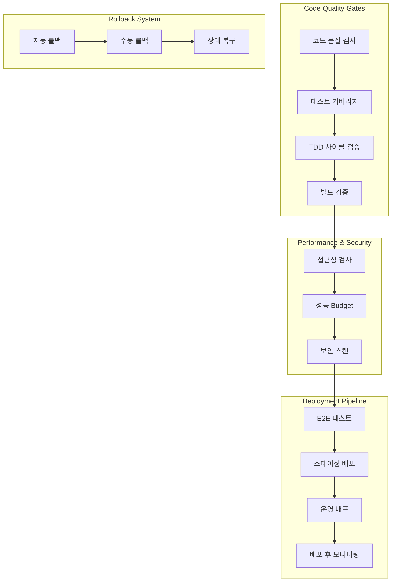
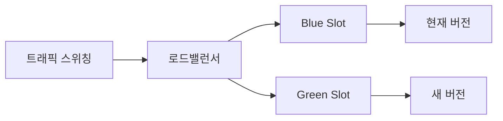

# 🚀 VRidge CI/CD 아키텍처 가이드

## 개요

VRidge 프로젝트의 완전한 CI/CD 파이프라인 아키텍처는 **8단계 품질 게이트**를 통해 운영 환경까지 안전하고 신뢰할 수 있는 배포를 보장합니다.

## 🏗️ 아키텍처 구성

### 파이프라인 개요



## 📊 8단계 품질 게이트

### 1. 코드 품질 검사 (Code Quality)
- **ESLint**: 코드 스타일 및 패턴 검사
- **TypeScript**: 타입 안전성 검증
- **Prettier**: 코드 포맷팅 일관성
- **FSD 아키텍처 검증**: 의존성 방향 및 레이어 준수

```bash
npm run lint
npm run type-check
npm run format:check
node scripts/validate-architecture.js
```

### 2. 테스트 커버리지 (Test Coverage)
- **전체 커버리지**: 70% 이상
- **핵심 기능**: 90% 이상 (RBAC, VideoFeedback, VideoPlanning)
- **TDD 사이클**: Red→Green→Refactor 준수

```bash
npm run test:coverage
npm run test:ci
```

### 3. TDD 사이클 검증 (TDD Validation)
- 실패하는 테스트 확인 (Red 단계)
- 타임아웃 방지 메커니즘
- 안전한 테스트 환경 검증

### 4. 빌드 및 타입 안전성 (Build Validation)
- **Next.js 프로덕션 빌드**
- **TypeScript 컴파일 검증**
- **번들 크기 분석** (1MB 이하 권장)

```bash
npm run build
npx tsc --noEmit --skipLibCheck
```

### 5. 접근성 검사 (Accessibility Audit)
- **WCAG 2.1 AA** 완전 준수
- **axe-core** 기반 자동 검사
- **키보드 네비게이션** 테스트

### 6. 성능 Budget (Performance Budget)
- **Core Web Vitals** 임계값 검사
  - LCP < 2.5s
  - FID < 100ms  
  - CLS < 0.1
- **Lighthouse CI** 자동 실행
- **성능 점수 85점 이상**

### 7. E2E 테스트 (End-to-End Tests)
- **Playwright** 기반 테스트
- **크리티컬 패스** 전체 검증
- **다중 브라우저** 지원

```bash
npm run test:e2e
npm run test:e2e:critical
```

### 8. 품질 게이트 요약 (Quality Gate Summary)
- 모든 게이트 통과 여부 확인
- **PR 댓글 자동 생성**
- **실패 시 병합 차단**

## 🔄 배포 전략

### 환경별 배포

| 환경 | URL | 트리거 | 검증 레벨 |
|------|-----|--------|----------|
| **스테이징** | staging.vridge.vlanet.net | PR 생성 | 기본 + 스모크 테스트 |
| **운영** | vridge.vlanet.net | 태그 생성/Release | 전체 + 수동 승인 |

### Blue-Green 배포



**특징:**
- **무중단 배포** 보장
- **즉시 롤백** 가능 (30초 이내)
- **카나리 배포** 옵션 제공

### 자동 롤백 시스템

**트리거 조건:**
- **에러율** > 2%
- **응답시간** > 5초
- **Core Web Vitals** 임계값 초과
- **헬스체크** 3회 연속 실패

**롤백 절차:**
1. **백업 생성** (현재 상태)
2. **이전 버전으로 복구**
3. **헬스체크 수행**
4. **알림 발송** (Slack/이메일)

## 📈 성능 모니터링

### 실시간 메트릭 수집

```typescript
// 성능 모니터링 초기화
import { initPerformanceMonitor } from '@/lib/performance-monitor';

const monitor = initPerformanceMonitor({
  lcp: 2500,
  fid: 100,
  cls: 0.1
});

// 알림 콜백 등록
monitor.onAlert((alert) => {
  console.warn('성능 임계값 초과:', alert);
});
```

### 수집되는 메트릭

| 메트릭 | 목적 | 임계값 |
|--------|------|-------|
| **LCP** | 로딩 성능 | 2.5초 |
| **FID** | 인터랙션 응답성 | 100ms |
| **CLS** | 시각적 안정성 | 0.1 |
| **API 응답시간** | 백엔드 성능 | 2초 |
| **비디오 로딩** | 미디어 성능 | 5초 |

### 모니터링 대시보드

**실시간 확인 가능한 지표:**
- Core Web Vitals 트렌드
- 페이지별 성능 점수
- 사용자 세션 분석
- 알림 히스토리

## 🔒 보안 검증

### 자동 보안 스캔

1. **의존성 취약점 검사**
   ```bash
   npm audit --audit-level=high
   ```

2. **CodeQL 보안 스캔**
   - 정적 코드 분석
   - 보안 취약점 탐지

3. **컨테이너 이미지 스캔**
   - Trivy를 통한 이미지 스캔
   - SARIF 결과 GitHub 업로드

4. **시크릿 스캔**
   - GitLeaks로 민감정보 탐지

## 🛠️ 설정 파일

### 주요 설정 파일 목록

```
.github/workflows/
├── quality-gates.yml          # 8단계 품질 게이트
├── production-deploy.yml      # 운영 배포 파이프라인
└── rollback.yml              # 자동 롤백 시스템

scripts/
├── validate-architecture.js   # FSD 아키텍처 검증
└── docker-healthcheck.sh     # 컨테이너 헬스체크

configs/
├── .eslintrc.boundaries.json # 의존성 경계 검증
├── playwright.staging.config.ts
├── playwright.production.config.ts
├── .lighthouserc.production.json
└── Dockerfile               # 멀티스테이지 컨테이너 빌드
```

## 🚀 배포 프로세스

### 1. 개발 → 스테이징

1. **PR 생성** → 8단계 품질 게이트 실행
2. **품질 게이트 통과** → 스테이징 자동 배포
3. **스모크 테스트** → 기본 기능 검증
4. **PR 병합** 준비 완료

### 2. 스테이징 → 운영

1. **태그 생성** (v2.1.0) 또는 Release 발행
2. **보안 검증** → 취약점 스캔
3. **컨테이너 빌드** → 멀티플랫폼 이미지
4. **Blue-Green 배포** → 무중단 배포
5. **성능 모니터링** → 5분간 메트릭 수집
6. **트래픽 스위칭** → 운영 환경 완료

### 3. 롤백 (필요시)

**자동 롤백:**
- 성능 임계값 초과 감지 시 자동 실행

**수동 롤백:**
```bash
gh workflow run rollback.yml \
  --field target_environment=production \
  --field rollback_to=v2.0.1 \
  --field reason="성능 이슈로 인한 긴급 롤백"
```

## 📋 체크리스트

### 배포 전 확인사항

- [ ] **모든 품질 게이트 통과**
- [ ] **테스트 커버리지 70% 이상**
- [ ] **Core Web Vitals 임계값 준수**
- [ ] **보안 취약점 없음**
- [ ] **FSD 아키텍처 준수**

### 배포 후 확인사항

- [ ] **헬스체크 통과**
- [ ] **성능 메트릭 정상**
- [ ] **에러율 2% 이하**
- [ ] **사용자 세션 정상**

## 🔧 문제해결

### 자주 발생하는 이슈

1. **테스트 타임아웃**
   ```bash
   # 해결책: act() 래핑 및 MSW 핸들러 최적화
   npm run test:unit -- --reporter=verbose
   ```

2. **빌드 크기 초과**
   ```bash
   # 번들 분석
   npm run build
   npx @next/bundle-analyzer
   ```

3. **성능 임계값 초과**
   ```bash
   # Lighthouse 로컬 실행
   npm run lighthouse:local
   ```

## 📞 지원 및 연락처

**담당자:**
- **CI/CD 파이프라인**: Chief Architect Arthur
- **성능 모니터링**: Frontend Lead Eleanor  
- **품질 게이트**: QA Lead Grace

**긴급 연락처:**
- Slack: #vridge-devops
- 이메일: dev@vlanet.net

---

**마지막 업데이트**: 2025-08-27  
**버전**: 2.1.0  
**문서 관리자**: Chief Architect Arthur