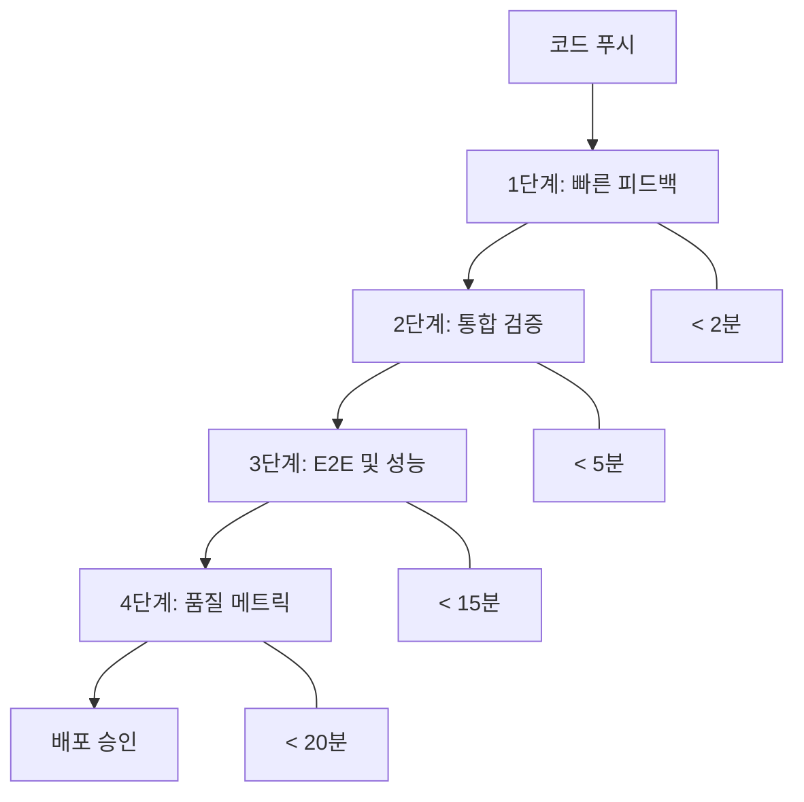

# CI/CD 4단계 품질 게이트 실행 계획

## 개요
VRidge 5개 모듈의 병렬 개발을 지원하는 계층화된 CI/CD 품질 게이트 시스템

## 4단계 파이프라인 아키텍처



## 1단계: 빠른 피드백 (< 2분)

### 목적
개발자에게 즉각적인 피드백 제공, 기본적인 코드 품질 보장

### 실행 항목
```yaml
# .github/workflows/stage1-quick-feedback.yml
name: Stage 1 - Quick Feedback

on:
  push:
    branches: [ feature/*, develop ]
  pull_request:
    branches: [ develop, main ]

jobs:
  quick-feedback:
    runs-on: ubuntu-latest
    timeout-minutes: 3
    
    steps:
    - uses: actions/checkout@v4
    
    - name: Setup Node.js
      uses: actions/setup-node@v4
      with:
        node-version: '20'
        cache: 'npm'
    
    # 병렬 실행으로 시간 단축
    - name: Install dependencies
      run: npm ci --prefer-offline --no-audit
      
    - name: Parallel Quality Checks
      run: |
        npm run lint &
        npm run type-check &
        npm run test:unit --reporter=basic &
        wait
      
    - name: Quick Security Scan
      run: npm audit --audit-level=high
      
    # 모듈별 빠른 테스트
    - name: Module-specific Quick Tests
      run: |
        # 각 모듈의 핵심 기능만 빠르게 테스트
        npm run test:dashboard:smoke &
        npm run test:calendar:smoke &  
        npm run test:project:smoke &
        npm run test:planning:smoke &
        npm run test:feedback:smoke &
        wait
```

### 실패 기준
- TypeScript 컴파일 오류
- ESLint 오류 (warning은 허용)
- Critical 유닛 테스트 실패
- High severity 보안 취약점

### 모듈별 Smoke Test 예시
```typescript
// test/smoke/dashboard.smoke.test.ts
describe('대시보드 핵심 기능 Smoke Test', () => {
  it('대시보드 컴포넌트 렌더링', () => {
    expect(() => render(<Dashboard />)).not.toThrow()
  })
  
  it('피드 데이터 로딩', async () => {
    const { getByTestId } = render(<Dashboard />)
    await waitFor(() => {
      expect(getByTestId('feed-container')).toBeInTheDocument()
    })
  })
})
```

## 2단계: 통합 검증 (< 5분)

### 목적
모듈간 통합 안정성 검증, API 계약 준수 확인

### 실행 항목
```yaml
# .github/workflows/stage2-integration.yml  
name: Stage 2 - Integration Verification

on:
  workflow_run:
    workflows: ["Stage 1 - Quick Feedback"]
    types: [completed]
    branches: [develop, main]

jobs:
  integration-tests:
    runs-on: ubuntu-latest
    timeout-minutes: 6
    if: ${{ github.event.workflow_run.conclusion == 'success' }}
    
    services:
      postgres:
        image: postgres:17
        env:
          POSTGRES_PASSWORD: test
          POSTGRES_DB: vridge_test
        options: >-
          --health-cmd pg_isready
          --health-interval 10s
          --health-timeout 5s
          --health-retries 5
          
      redis:
        image: redis:7
        options: >-
          --health-cmd "redis-cli ping"
          --health-interval 10s
          --health-timeout 5s
          --health-retries 5
    
    steps:
    - uses: actions/checkout@v4
    
    - name: Setup Node.js  
      uses: actions/setup-node@v4
      with:
        node-version: '20'
        cache: 'npm'
        
    - name: Install dependencies
      run: npm ci
      
    # API Contract 검증
    - name: Contract Testing
      run: |
        npm run test:contracts
        npm run validate:api-schemas
        
    # 모듈간 통합 테스트
    - name: Cross-Module Integration
      run: |
        npm run test:integration:dashboard-project &
        npm run test:integration:calendar-project &
        npm run test:integration:planning-feedback &
        wait
        
    # 데이터베이스 마이그레이션 테스트
    - name: Database Migration Test
      run: |
        cd vridge_back
        python manage.py migrate --run-syncdb
        python manage.py test --parallel --keepdb
        
    # API 엔드포인트 통합 테스트
    - name: API Integration Tests
      run: npm run test:api:integration
```

### Contract 테스트 예시
```typescript
// test/contracts/auth-project.contract.test.ts
describe('인증-프로젝트 모듈 Contract 테스트', () => {
  it('인증된 사용자만 프로젝트 CRUD 가능', async () => {
    // Mock 없이 실제 API 계약 검증
    const authToken = await getTestAuthToken()
    const response = await fetch('/api/projects', {
      headers: { Authorization: `Bearer ${authToken}` }
    })
    
    expect(response.status).toBe(200)
    expect(await response.json()).toMatchSchema(ProjectListSchema)
  })
})
```

## 3단계: E2E 및 성능 (< 15분)

### 목적
실제 사용자 시나리오 검증, 성능 회귀 방지

### 실행 항목
```yaml
# .github/workflows/stage3-e2e-performance.yml
name: Stage 3 - E2E and Performance

on:
  workflow_run:
    workflows: ["Stage 2 - Integration Verification"]  
    types: [completed]
    branches: [develop, main]

jobs:
  e2e-tests:
    runs-on: ubuntu-latest
    timeout-minutes: 18
    if: ${{ github.event.workflow_run.conclusion == 'success' }}
    
    steps:
    - uses: actions/checkout@v4
    
    - name: Setup Node.js
      uses: actions/setup-node@v4
      with:
        node-version: '20'
        cache: 'npm'
    
    # 실제 환경과 유사한 설정
    - name: Build Application
      run: |
        npm ci
        npm run build
        
    - name: Start Application
      run: |
        npm run start:test &
        npx wait-on http://localhost:3000
        
    # 핵심 사용자 여정 테스트
    - name: Critical User Journeys
      run: |
        npm run e2e:auth-flow &
        npm run e2e:project-creation &
        npm run e2e:video-feedback &
        wait
        
    # 성능 테스트
    - name: Performance Regression Test
      run: |
        npm run lighthouse:ci
        npm run load-test:basic
        
    # 접근성 테스트
    - name: Accessibility Test  
      run: npm run a11y:test
      
    - name: Upload E2E Results
      uses: actions/upload-artifact@v4
      if: failure()
      with:
        name: e2e-screenshots
        path: test-results/
```

### 핵심 E2E 시나리오
```typescript
// test/e2e/critical-user-journey.spec.ts
test.describe('핵심 사용자 여정', () => {
  test('프로젝트 생성부터 피드백까지 완전한 플로우', async ({ page }) => {
    // 1단계: 로그인
    await page.goto('/login')
    await page.fill('[data-testid="email"]', 'test@example.com')
    await page.fill('[data-testid="password"]', 'password')
    await page.click('[data-testid="login-button"]')
    
    // 2단계: 프로젝트 생성
    await page.goto('/projects/create')
    await page.fill('[data-testid="project-name"]', 'E2E Test Project')
    await page.click('[data-testid="create-project"]')
    
    // 3단계: 영상 기획
    await page.click('[data-testid="video-planning"]')
    await page.fill('[data-testid="concept-input"]', '브랜드 홍보 영상')
    await page.click('[data-testid="generate-plan"]')
    
    // 4단계: 일정 등록
    await page.goto('/calendar')
    await page.click('[data-testid="add-schedule"]')
    await page.fill('[data-testid="schedule-title"]', '촬영 일정')
    await page.click('[data-testid="save-schedule"]')
    
    // 5단계: 피드백 작성
    await page.goto('/feedback')
    await page.click('[data-testid="add-comment"]')
    await page.fill('[data-testid="comment-text"]', '수정 필요')
    await page.click('[data-testid="submit-comment"]')
    
    // 최종 검증: 대시보드에서 모든 활동 확인
    await page.goto('/dashboard')
    await expect(page.locator('[data-testid="recent-activity"]')).toContainText('E2E Test Project')
  })
})
```

## 4단계: 품질 메트릭 (< 20분)

### 목적
코드 품질 메트릭 수집, 장기적 품질 트렌드 분석

### 실행 항목
```yaml
# .github/workflows/stage4-quality-metrics.yml
name: Stage 4 - Quality Metrics

on:
  workflow_run:
    workflows: ["Stage 3 - E2E and Performance"]
    types: [completed]  
    branches: [develop, main]

jobs:
  quality-metrics:
    runs-on: ubuntu-latest
    timeout-minutes: 25
    if: ${{ github.event.workflow_run.conclusion == 'success' }}
    
    steps:
    - uses: actions/checkout@v4
      with:
        fetch-depth: 0 # SonarQube를 위한 전체 히스토리
        
    - name: Setup Node.js
      uses: actions/setup-node@v4  
      with:
        node-version: '20'
        cache: 'npm'
        
    - name: Install dependencies
      run: npm ci
      
    # 완전한 테스트 커버리지 분석
    - name: Full Test Coverage
      run: |
        npm run test:coverage:full
        npm run coverage:merge
        
    # 뮤테이션 테스트 (코드 품질 검증)
    - name: Mutation Testing
      run: npm run test:mutation
      
    # 코드 복잡도 분석
    - name: Code Complexity Analysis
      run: |
        npm run analyze:complexity
        npm run analyze:dependencies
        
    # 성능 메트릭 수집
    - name: Performance Metrics
      run: |
        npm run analyze:bundle-size
        npm run measure:runtime-performance
        
    # SonarQube 분석
    - name: SonarQube Scan
      uses: sonarqube-quality-gate-action@master
      env:
        GITHUB_TOKEN: ${{ secrets.GITHUB_TOKEN }}
        SONAR_TOKEN: ${{ secrets.SONAR_TOKEN }}
        
    # 품질 리포트 생성
    - name: Generate Quality Report
      run: npm run generate:quality-report
      
    # Slack 알림
    - name: Quality Gate Results
      uses: 8398a7/action-slack@v3
      if: always()
      with:
        status: custom
        custom_payload: |
          {
            attachments: [{
              color: '${{ job.status }}' === 'success' ? 'good' : 'danger',
              text: `품질 게이트 결과: ${{ job.status }}\n커버리지: ${COVERAGE}%\n뮤테이션 스코어: ${MUTATION_SCORE}%`
            }]
          }
      env:
        SLACK_WEBHOOK_URL: ${{ secrets.SLACK_WEBHOOK }}
```

### 품질 메트릭 기준점

#### 모듈별 커버리지 임계값
```typescript
// quality.config.ts
export const qualityThresholds = {
  coverage: {
    dashboard: { lines: 85, branches: 80, functions: 85 },
    calendar: { lines: 90, branches: 85, functions: 90 },
    projectManagement: { lines: 88, branches: 83, functions: 88 },
    videoPlanning: { lines: 75, branches: 70, functions: 75 },
    videoFeedback: { lines: 82, branches: 77, functions: 82 }
  },
  
  performance: {
    bundleSize: {
      dashboard: '150kb',
      calendar: '200kb', 
      projectManagement: '180kb',
      videoPlanning: '250kb', // LLM 클라이언트 포함
      videoFeedback: '300kb'  // 비디오 플레이어 포함
    },
    
    renderTime: {
      dashboard: 100,    // ms
      calendar: 200,     // ms  
      projectManagement: 150,
      videoPlanning: 300,
      videoFeedback: 500 // 비디오 로딩 시간 포함
    }
  },
  
  mutation: {
    overall: 75,
    critical: 90  // 인증, 권한, 결제 등
  }
}
```

## 품질 게이트 실패 시 대응 절차

### 1단계 실패
- **즉시 차단**: PR 머지 불가
- **개발자 알림**: Slack DM + 이메일
- **복구 시간**: 30분 내

### 2단계 실패  
- **브랜치 차단**: develop 브랜치 보호
- **팀 알림**: 담당 모듈 팀 전체 알림
- **복구 시간**: 2시간 내

### 3단계 실패
- **배포 중단**: 자동 배포 파이프라인 중단
- **전체 알림**: 전 개발팀 + PM 알림
- **복구 시간**: 1일 내

### 4단계 실패
- **품질 리뷰**: 코드 리뷰 추가 요구
- **기술 부채 등록**: 백로그에 개선 작업 등록
- **복구 시간**: 1주 내

## 성능 최적화 전략

### 파이프라인 병렬화
```yaml
# 병렬 실행으로 전체 시간 단축
strategy:
  matrix:
    module: [dashboard, calendar, project, planning, feedback]
    
steps:
- name: Test Module ${{ matrix.module }}
  run: npm run test:${{ matrix.module }}
```

### 캐싱 전략
- **의존성 캐시**: package-lock.json 기반
- **빌드 캐시**: .next 디렉토리 캐시
- **테스트 캐시**: Jest 캐시 활용
- **Docker 캐시**: 멀티스테이지 빌드 캐시

### 점진적 테스트
```typescript
// 변경된 파일만 테스트
const changedFiles = getChangedFiles()
const affectedModules = getAffectedModules(changedFiles)
runTestsFor(affectedModules)
```

## 성공 지표
- **전체 파이프라인 시간**: < 20분
- **1단계 성공률**: 95%
- **false positive 비율**: < 5% 
- **개발자 만족도**: 8/10 이상
- **배포 실패율**: < 2%