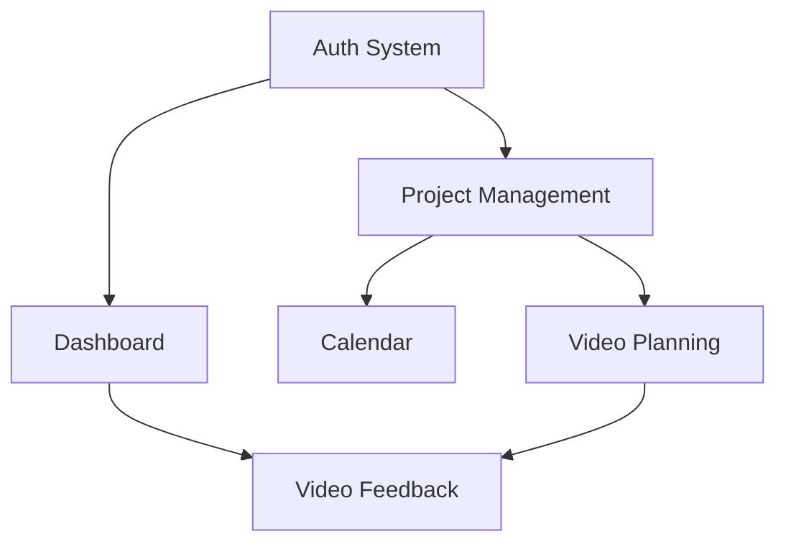

# VRidge 병렬 개발 TDD 프레임워크

## 개요
5개 핵심 모듈의 병렬 개발을 위한 Test-Driven Development 전략과 실행 프레임워크

## 병렬 개발 TDD 사이클 최적화

### Phase 1: 모듈별 동기화된 Red Phase (1주차)
각 모듈 팀이 동시에 실패하는 테스트 작성

```typescript
// 모든 팀이 동일한 타임라인으로 진행
// Week 1: Red Phase (Failing Tests)
// 📍 대시보드팀: Dashboard.test.tsx - 실시간 피드 집계 테스트
// 📍 캘린더팀: Calendar.test.tsx - 충돌 감지 알고리즘 테스트  
// 📍 프로젝트팀: ProjectManagement.test.tsx - RBAC 매트릭스 테스트
// 📍 기획팀: VideoPlanning.test.tsx - LLM 오케스트레이션 테스트
// 📍 피드백팀: VideoFeedback.test.tsx - 플레이어 동기화 테스트
```

#### Red Phase 병렬 동기화 규칙:
- **Daily Standup**: 각 팀의 실패 테스트 현황 공유
- **Test Sync Point**: 매일 오후 5시 모든 팀의 테스트 상태 동기화
- **Dependency Map**: 모듈간 의존성 테스트 우선순위 조정

### Phase 2: 독립적 Green Phase (2-3주차)
모듈별 독립적인 최소 구현

```typescript
// 각 팀이 독립적으로 최소 구현 진행
// Week 2-3: Green Phase (Minimal Implementation)
// 🟢 팀별 독립 작업, 공통 API Contract만 준수
// 🟢 Mock 데이터로 다른 모듈과의 통합 포인트 시뮬레이션
```

#### Green Phase 독립성 보장:
- **API Contract First**: 모듈간 인터페이스 사전 정의
- **Mock-First Development**: 외부 모듈 의존성 완전 모킹
- **Isolated Testing**: 각 모듈은 자체 테스트 스위트에서만 작업

### Phase 3: 통합된 Refactor Phase (4주차)
전체 시스템 리팩토링 및 통합

```typescript
// Week 4: Refactor & Integration Phase
// 🔄 Cross-module refactoring
// 🔄 Performance optimization
// 🔄 Code quality improvement
```

## 모듈별 TDD 전문화 전략

### 대시보드 모듈 (85% 커버리지)
**복잡도**: 중간 - 실시간 데이터 집계
**TDD 접근법**: State-driven TDD

```typescript
// Dashboard TDD Pattern
describe('대시보드 실시간 피드 집계', () => {
  beforeEach(() => {
    // 실시간 데이터 스트림 모킹
    mockRealtimeFeed()
  })

  it('읽지 않음 배지가 9+ 표시 시 정확한 카운트 제공', async () => {
    // Red: 실패하는 테스트 작성
    const { getByTestId } = render(<Dashboard />)
    
    // 10개 읽지 않은 알림 시뮬레이션
    fireEvent.change(getByTestId('notification-stream'), { 
      target: { value: '10' } 
    })
    
    await waitFor(() => {
      expect(getByTestId('unread-badge')).toHaveTextContent('9+')
    })
  })
  
  it('간트 차트 요약이 프로젝트 진행률 정확 표시', () => {
    // Red Phase 테스트 케이스
  })
})
```

### 캘린더 모듈 (90% 커버리지)  
**복잡도**: 높음 - 충돌 감지 알고리즘
**TDD 접근법**: Algorithm-driven TDD

```typescript
// Calendar TDD Pattern
describe('촬영 충돌 감지 알고리즘', () => {
  it('같은 시간대 촬영 일정 충돌 감지', () => {
    const schedule1 = createSchedule('2025-08-26T09:00:00', '2025-08-26T11:00:00')
    const schedule2 = createSchedule('2025-08-26T10:00:00', '2025-08-26T12:00:00')
    
    const conflicts = detectConflicts([schedule1, schedule2])
    
    expect(conflicts).toHaveLength(1)
    expect(conflicts[0].type).toBe('SHOOTING_OVERLAP')
    expect(conflicts[0].duration).toBe(60) // minutes
  })

  it('드래그앤드롭 일정 조정 시 권한 검증', () => {
    // Red Phase: 권한 기반 드래그 제한 테스트
  })
})
```

### 프로젝트 관리 모듈 (88% 커버리지)
**복잡도**: 중간 - RBAC 권한 시스템
**TDD 접근법**: Permission-driven TDD

```typescript
// Project Management TDD Pattern  
describe('RBAC 권한 매트릭스', () => {
  const roleMatrix = {
    Owner: ['CREATE', 'READ', 'UPDATE', 'DELETE', 'INVITE'],
    Admin: ['CREATE', 'READ', 'UPDATE', 'INVITE'],
    Editor: ['READ', 'UPDATE'],
    Reviewer: ['READ', 'COMMENT'],
    Viewer: ['READ']
  }

  it.each([
    ['Owner', 'DELETE', true],
    ['Admin', 'DELETE', false], 
    ['Editor', 'DELETE', false],
    ['Reviewer', 'UPDATE', false],
    ['Viewer', 'COMMENT', false]
  ])('%s 역할이 %s 권한을 %s', (role, permission, expected) => {
    const hasPermission = checkPermission(role, permission)
    expect(hasPermission).toBe(expected)
  })

  it('SendGrid 이메일 쿨다운 로직 적용', () => {
    // Red Phase: 이메일 발송 제한 테스트
  })
})
```

### 영상 기획 모듈 (75% 커버리지)
**복잡도**: 최고 - LLM API 통합
**TDD 접근법**: Contract-driven TDD

```typescript
// Video Planning TDD Pattern
describe('LLM 오케스트레이션', () => {
  beforeEach(() => {
    // Google Gemini API 완전 모킹
    mockGeminiAPI()
  })

  it('3단계 위저드 플로우 완료', async () => {
    const wizard = render(<PlanningWizard />)
    
    // Step 1: 컨셉 입력
    await userEvent.type(wizard.getByLabelText('영상 컨셉'), '브랜드 홍보 영상')
    await userEvent.click(wizard.getByText('다음 단계'))
    
    // Step 2: LLM 제안 확인
    await waitFor(() => {
      expect(wizard.getByText('AI 제안사항')).toBeInTheDocument()
    })
    
    // Step 3: PDF 생성 완료
    await userEvent.click(wizard.getByText('기획서 생성'))
    await waitFor(() => {
      expect(wizard.getByText('PDF 다운로드')).toBeInTheDocument()
    })
  })

  it('LLM API 장애 시 fallback 처리', async () => {
    // Red Phase: API 실패 시나리오 테스트
    mockGeminiAPIFailure()
    
    const wizard = render(<PlanningWizard />)
    // fallback 로직 테스트
  })
})
```

### 영상 피드백 모듈 (82% 커버리지)
**복잡도**: 높음 - 비디오 동기화
**TDD 접근법**: Event-driven TDD

```typescript
// Video Feedback TDD Pattern
describe('비디오 플레이어 타임코드 동기화', () => {
  it('코멘트 타임스탬프와 플레이어 동기화', async () => {
    const player = render(<VideoPlayer src="test-video.mp4" />)
    const feedback = render(<FeedbackPanel />)
    
    // 특정 시점에서 코멘트 추가
    fireEvent.timeUpdate(player.getByRole('video'), { currentTime: 120.5 })
    await userEvent.type(feedback.getByLabelText('피드백'), '이 부분 수정 필요')
    await userEvent.click(feedback.getByText('코멘트 추가'))
    
    // 코멘트 클릭 시 플레이어 자동 이동
    await userEvent.click(feedback.getByText('이 부분 수정 필요'))
    
    expect(player.getByRole('video')).toHaveAttribute('currentTime', '120.5')
  })

  it('실시간 코멘트 스크린샷 첨부', () => {
    // Red Phase: 스크린샷 캡처 및 첨부 테스트
  })
})
```

## 병렬 작업 조율 메커니즘

### 1. Test Dependency Graph


### 2. Daily TDD Sync Points
- **9:00 AM**: 각 팀 TDD Phase 동기화
- **1:00 PM**: Cross-module integration 이슈 공유  
- **5:00 PM**: 테스트 커버리지 현황 리포트

### 3. Weekly Integration Points
- **월요일**: Red Phase 목표 설정
- **수요일**: Green Phase 중간 점검
- **금요일**: Refactor Phase 통합 테스트

## 성공 지표
- **TDD 사이클 준수율**: 85%+
- **병렬 개발 효율성**: 전통적 순차 개발 대비 40% 시간 단축
- **Cross-module 버그 감소**: 60% 감소 목표
- **개발자 만족도**: 8/10 점 이상